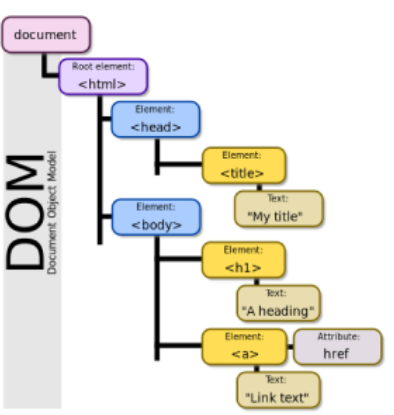

# JavaScript 기초

## JavaScript Intro

### 동작 방식

서버 -(response/HTML,CSS)-> 브라우저


### 브라우저 (browser)

- URL로 웹(WWW)을 탐색하며 서버와 통신하고,

  HTML 문서나 파일을 출력하는 GUI 기반의 소프트웨어

- 인터넷의 컨텐츠를 검색 및 열람하도록 함

- '웹 브라우저'라고도 함

- 주요 브라우저

  - Google Chrome, Mozilla Firefox, Microsoft Edge, Opera, Safari


### JavaScript의 필요성

- 브라우저 화면을 '동적'으로 만들기 위함

- 브라우저를 조작할 수 있는 유일한 언어

  


### Most Popular Programming Language in 2021 survey

- Stackoverflow

  


- Jetbrain

  


## Browser

### 브라우저에서 할 수 있는 일

- DOM(Document Obejct Model) 조작
  - 문서(HTML) 조작
- BOM(Browser Object Model) 조작
  - navigator, screen, location, frames, history, XHR
- JavaScript Core (ECMAScript)
  - Data Structure(Object, Array), Conditional Expression, Iteration


### DOM이란?

- HTML, XML과 같은 문서를 다루기 위한 프로그래밍 인터페이스
- 문서를 구조화하고, 구조화된 구성 요소를 하나의 객체로 취급하여 다루는 논리적 트리 모델
- 문서가 객체(object)로 구조화되어 있으며 key로 접근 가능
- 단순한 속성 접근, 메서드 활용뿐만 아니라 프로그래밍 언어적 특성을 활용한 조작 가능
- 주요 객체
  - window: DOM을 표현하는 창(브라우저 탭), 최상위 객체 (작성 시 생략 가능)
  - document: 페이지 컨텐츠의 Entry Point 역할을 하며, \<head\>, \<body\> 등과 같은 수많은 다른요소들을 포함
  - navigator, location, history, screen


### DOM




### DOM - 해석

- 파싱 (parsing)

  - 구문 분석, 해석
  - 브라우저가 문자열을 해석하여 DOM Tree로 만드는 과정

  


### DOM - 조작


### BOM 이란?

- Browser Object Model
- 자바스크립트가 브라우저와 소통하기 위한 모델
- 브라우저의 창이나 프레임을 초상화해서 프로그래밍적으로 제어할 수 있도록 제공하는 수단
  - 버튼, URL 입력창, 타이틀 바 등 브라우저 윈도우 및 앱 페이지 일부분을 제어 가능
- window 객체는 모든 브라우저로부터 지원받으며 브라우저의 창(window)를 지칭


### BOM 조작


### JavaScript Core

- 브라우저(BOM&DOM)을 조작하기 위한 명령어 약속(언어)

  


### 정리


브라우저(BOM)과 그 내부의 문서(DOM)를 조작하기 위해 ECMAScript(JS)를 학습


## ECMAScript

## Introduction

### ECMA?

- ECMA(ECMA INternational)
  - 정보 통신에 대한 표준을 제정하는 비영리 표준화 기구
- ECMAScript는 ECMA에서 ECMA-262* 규격에 따라 정의한 언어
  - ECMA-262*: 범용적인 목적의 프로그래밍 언어에 대한 명세
- ECMAScript6는 ECMA에서 제안하는 6번째 표준 명세를 말함
  - (참고) ECMAScript6의 발표 연도에 따라 ECMAScript2015라고도 불림


## 세미콜론

### 세미콜론 (semicolon)

- 자바스크립트는 세미콜론을 선택적으로 사용 가능
- 세미콜론이 없으면 ASI*에 의해 자동으로 세미콜론이 삽입됨
  - ASI*: 자동 세미콜론 삽입 규칙 (Automatic Semicolon Insertion)
- 본 수업에서는 자바스크립트의 문법 및 개념적 측면에 집중하기 위해 세미콜론을 사용하지 않고 진행


### 세미콜론 (semicolon) 예시

```javascript
// 세미콜론이 있는 경우
const greeting = 'Hello, world!';
console.log(greeting):

// 세미콜론이 없는 경우
const greeting - 'Hello, world!'
console.log(greeting)
```

선택적으로 사용 가능


## 코딩 스타일 가이드

### 코딩 스타일 가이드

- 코딩 스타일의 핵심은 합의된 원칙과 일관성
  - 절대적인 하나의 정답은 없으며, 상황에 맞게 원칙을 정하고 일관성 있게 사용하는 것이 중요
- 코딩 스타일은 코드의 품질에 직결되는 중요한 요소
  - 코드의 가독성, 유지보수 또는 팀원과의 커뮤니케이션 등 개발 과정 전체에 영향을 끼침
- (참고) 다양한 자바스크립트 코딩 스타일 가이드
  - Airbnb Javascript Style Guide
  - Google Javascript Style Guide
  - standardjs


### 코딩 스타일 가이드 예시

- 본 수업에서는 Airbnb Style Guide를 중심으로 진행할 예정
  - 단, 가이드의 일부 항목은 문법 및 개념적 측면에 집중하기 위해 변형해서 사용


## 변수와 식별자

### 식별자 정의와 특징

- 식별자(identifier)는 변수를 구분할 수 있는 변수명을 말함

- 식별자는 반드시 문자, 달러($) 또는 밑줄(_)로 시작
- 대소문자를 구분하며, 클래스명 외에는 모두 소문자로 시작
- 예약어* 사용 불가능
  - 예약어 예시:for, if, function 등


### 식별자 작성 스타일

- 카멜 케이스(camelCase, lower-camel-case)
  - 변수, 객체, 함수에 사용
- 파스칼 케이스(PascalCase, upper-camel-case)
  - 클래스, 생성자에 사용
- 대문자 스네이크 케이스(SNAKE_CASE)
  - 상수(constants)*에 사용
    - 상수의 정의: 개발자의 의도와 상관없이 변경될 가능성이 없는 값을 의미


- 카멜케이스 (camelCase)

  두 번째 단어의 첫 글자부터 대문자

  ```javascript
  // 변수
  let dog
  let variableName
  
  // 객체
  const userInfo = { name: 'Tom', age: 20 }
  
  // 함수
  function add() {}
  function getName() {}
  ```

- 파스칼 케이스 (PascalCase)

  모든 단어의 첫 번째 글자를 대문자로 작성

  ```javascript
  // 클래스
  calss User {
      constructor(options) {
          this.name = options.name
      }
  }
  
  // 생성자 함수
  function User(options) {
      this.name = options.name
  }
  ```

- 대문자 스네이크 케이스 (SNAKE_CASE)

  모든 단어 대문자 작성 & 단어 사이에 언더스코어 삽입

  ```javascript
  // 값이 바뀌지 않을 상수
  const API_KEY = 'my-key'
  const PI = Math.PI
  
  // 재할당이 일어나지 않는 변수
  const numbers = [1, 2, 3]
  ```


### 변수 선언 키워드 (let, const)

#### let

- 재할당 할 예정인 변수 선언 시 사용
- 변수 재선언 불가능
- 블록 스코프*

#### const

- 재할당 할 예정이 없는 변수 선언 시 사용
- 변수 재선언 불가능
- 블록 스코프*


### \(참고\) 선언, 할당, 초기화

```javascript
let foo           // 선언
console.log(foo)  // undefined

foo = 11          // 할당
console.log(foo)  // 11

let bar = 0       // 선언 + 할당
console.log(bar)  // 0
```

- 선언 (Declaration)
  - 변수를 생성하는 행위 또는 시점
- 할당 (Assignment)
  - 선언된 변수에 값을 저장하는 행위 또는 시점
- 초기화 (Initiialization)
  - 선언된 변수에 처음으로 값을 저장하는 행위 또는 시점


### 변수 선언 키워드 (let, const) 예시 - 재할당

#### let(재할당 가능)

```javascript
let number = 10      // 1. 선언 및 초기값 할당
number = 10          // 2. 재할당

console.log(number)  // 10
```

#### const (재할당 불가능)

```javascript
const number = 10  // 1. 선언 및 초기값 할당
number = 10        // 2. 재할당 불가능

=> Uncaught TypeError
	:Assignment to constant variable.
```


### 변수 선언 키워드 (let, const) 예시 - 재선언

#### let  (재선언 불가능)

```javascript
let number = 10  // 1. 선언 및 초기값 할당
let number = 50  // 2. 재선언 불가능

=> Uncaught SyntaxError
	: Identifier 'number' has already been declared
```

#### const (재선언 불가능)

```javascript
const number = 10  // 1. 선언 및 초기값 할당
const number = 50  // 2. 재선언 불가능

=> Uncaught SyntaxError
	:Identifier 'number' has already been declared
```


### 변수 선언 키워드 (let, const)

```javascript
let x = 1

if (x==1) {
    let x = 2  // 블록스코프
    console.log(x)  // 2 // 블록스코프
}

console.log(x)      // 1
```

- 블록 스코프* (block scope)
  - if, for, 함수 등의 중괄호 내부를 가리킴
  - 블록 스코프를 가지는 변수는 블록 바깥에서 접근 불가능


### 변수 선언 키워드 - 'var'

- var

  - var로 선언한 변수는 재선언 및 재할당 모두 가능
  - ES6 이전에 변수를 선언할 때 사용되던 키워드
  - 호이스팅*되는 특성으로 인해 예기치 못한 문제 발생 가능
    - 따라서 ES6 이후부터는 var 대신 const와 let을 사용하는 것을 권장
  - 함수 스코프*

  ```javascript
  var number = 10  // 1. 선언 및 초기값 할등
  var number = 50  // 2. 재할당
  
  console.log(number )  // 50
  ```

  재선언 및 재할당 모두 가능

- 함수 스코프* (function scope)

  - 함수의 중괄호 내부를 가리킴
  - 함수 스코프를 가지는 변수는 함수 바깥에서 접근 불가능

  ```javascript
  function foo() {
      var x = 5
      console.log(x)  // 5
  }
  
  // ReferenceError: x is not defined
  console.log(x)
  ```

- 호이스팅* (hoisting)

  - 변수를 선언 이전에 참조할 수 있는 현상
  - 변수 선언 이전의 위치에서 접근 시 udnefined를 반환

  ```javascript
  console.log(usernmae) // undefined
  var usernmae = '홍길동'
  
  console.log(email)    // Uncaught RefernceError
  let email = 'gildong@gmail.com'
  
  console.log(age)	  // Uncaught ReferenceError
  const age = 50
  ```

  

### 변수와 식별자 Quiz

Q1. 자바스크립트 변수 선언 시 사용 가능한 키워드는 const와 let 뿐이다.

​	A1. 자바스크립트 변수 사용 시 사용 가능한 키워드는 const, let, 그리고 var이다.

Q2. const 키워드로 선언한 변수는 재할당이 가능하다.

​	A2. const 키워드로 선언한 변수는 재할당이 불가능하다.

Q3. let 키워드로 선언한 변수는 재할당이 가능하다.

​	A3. let 키워드로 선언한 변수는 재할당이 가능하다.


### let, const, var 비교

| 키워드 | 재선언 | 재할당 |      스코프 |     비고     |
| :----: | :----: | :----: | ----------: | :----------: |
|  let   |   x    |   o    | 블록 스코프 | ES6부터 도입 |
| const  |   x    |   x    | 블록 스코프 | ES6부터 도입 |
|  var   |   o    |   o    | 함수 스코프 |    사용 X    |


## 데이터 타입

### 데이터 타입 종류

- 자바스크립트의 모든 값은 특정한 데이터 타입을 가짐

- 크게 원시 타입* (Primitive type)과 참조 타입* (Reference type)으로 분류됨

  


### (참고) 원시 타입과 참조 타입 비교

- 원시 타입 (Primitive type)

  - 객체 (object)가 아닌 기본 타입
  - 변수에 해당 타입의 값이 담김
  - 다른 변수에 복사할 때 실제 값이 복사됨

  ```javascript
  let message = '안녕하세요!' // 1. message 선언 및 할당
  
  let greeting = message     // 2. greeting에 message 복사
  console.log(greeting)	   // 3. '안녕하세요!' 출력
  
  message = 'Hello, world!'  // 4. message 재할당
  console.log(greeting)      // 5. '안녕하세요!' 출력
  
  //=> 즉, 원시 타입은 실제 해당 타입의 값을 변수에 저장한다.
  ```

  

- 참조 타입 (Reference type)

  - 객체 (obejct) 타입의 자료형
  - 변수에 해당 객체의 참조 값이 담김
  - 다른 변수에 복사할 때 참조 값이 복사됨

  ```javascript
  const message = ['안녕하세요']  // 1. mesage 선언 및 할당
  
  const greeting = message  	  // 2. greeting에 message 복사
  console.log(greeting)		  // 3. ['안녕하세요!'] 출력
  
  message[0] = 'Hello, world!'   // 4. mesage 재할당
  console.log(greeting) 	 	  // 5. ['Hello, world!'] 출력
  
  //=> 즉, 참조 타입은 해당 객체를 참조할 수 있는 참조 값을 저장한다.
  ```


### 원시 타입 (Primitive type)

- 숫자 (Number) 타입

  - 정수, 실수 구분 없는 하나의 숫자 타입
  - 부동소수점 형식을 따름
  - (참고) NaN (Not-A-Number)
    - 계산 불가능한 경우 반환되는 값
      - ex) 'Angel' / 1004 => NaN

  ```javascript
  const a = 13		 // 양의 정수
  const b = -5		 // 음의 정수
  const c = 3.14		 // 실수
  const d = 2.998e8	 // 거듭제곱
  const e = Infinity	 // 양의 무한대
  const f = -Infinity	 // 음의 무한대
  const g = NaN		// 산술 연산 불가
  ```


- 문자열(string) 타입

  - 텍스트 데이터를 나타내는 타입
  - 16비트 유니코드 문자의 집합
  - 작은따옴표 또는 큰따옴표 모두 가능
  - 템플릿 리터럴 (Template Literal)
    - ES6부터 지원
    - 따옴표 대신 blacktick(\`  \`)으로 표현
    -  ${ expression } 형태로 표현식 삽입 가능

  ```javascript
  const firstName = 'Brandan'
  const lastName = 'Eich'
  const fullName = `${firstName} ${lastName}`
  
  console.log(fullName)	// Brandan Eich
  ```

  

- undefined

  - 변수의 값이 없음을 나타내는 데이터 타입
  - 변수 선언 이후 직접 값을 할당하지 않으면, 자동으로 undefined가 할당됨

  ```javascript
  let firstName
  console.log(firstName)	// undefined
  ```


- null

  - 변수의 값이 없음을 의도적으로 표현할 때 사용하는 데이터 타입
  - (참고) null 타입과 typeof 연산자*
    - typeof 연산자*: 자료형 평가를 위한 연산자
    - null 타입은 ECMA 명세의 원시 타입의 정의에 따라 원시 타입에 속하지만, typeof 연산자의 결과는 객체(obejct)로 표현됨

  ```javascript
  let firstName = null
  console.log(firstName)	// null
  typeof null			   // object
  ```

  

### (참고) undefined 타입과 null 타입 비교

#### undefined

- 빈 값을 표현하기 위한 데이터 타입
- 변수 선언 시 아무 값도 할당하지 않으면, 자바스크립트가 자동으로 할당
- typeof 연산자의 결과는 undefined

```javascript
typeof undefined	// undefined
```

#### null

- 빈 값을 표현하기 위한 데이터 타입
- 개발자가 의도적으로 필요한 경우 할당
- typeof 연산자의 결과는 object

```javascript
typeof null    // object
```


### 원시 타입

- Boolean 타입

  - 논리적 참 또는 거짓을 나타내는 타입
  - true 또는 false로 표현
  - 조건문 또는 반복문*에서 유용하게 사용
    - (참고) 조건문 또는 반복문에서 boolean이 아닌 데이터 타입은 자동 형변환 규칙에 따라 true 또는 false로 변환됨

  ```javascript
  let isAdmin = true
  console.log(isAdmin)	// true
  
  isAdmin = false
  console.log(isAdmin)	// false
  ```

### (참고) ToBoolean Conversions (자동 형변환) 정리

| 데이터 타입 |    거짓    |        참        |
| :---------: | :--------: | :--------------: |
|  Undefined  | 항상 거짓  |        x         |
|    Null     | 항상 거짓  |        x         |
|   Number    | 0, -0, NaN | 나머지 모든 경우 |
|   String    | 빈 문자열  | 나머지 모든 경우 |
|   Object    |     x      |     항상 참      |

조건문 또는 반복문에서 표현식의 결과가 참/거짓으로 판별되는 경우 발생


### 참조 타입 (Reference type)

- 자세한 내용은 해당 타입의 챕터 참고
- 타입 별 챕터 링크 목록
  - 함수 (Functions)
  - 배열 (Arrays)
  - 객체 (Objects)


## 연산자

### 할당 연산자

- 오른쪽에 있는 피연산자의 평가 결과를 왼쪽 피연산자에 할당하는 연산자

- 다양한 연산에 대한 단축 연산자 지원

- (참고) Increment 및 Decrement 연산자*

  - Increment(++): 피연산자의 값을 1 증가시키는 연산자
  - Decrement(--): 피연산자의 값을 1 감소시키는 연산자
  - Airbnb Style Guide에서는 '+=' 또는 '-='와 같이 더 분명한 표현으로 적을 것을 권장

  ```javascript
  let x = 0
  
  x += 10
  console.log(x)	// 10
  
  x -= 3
  console.log(x)	// 7
  
  x *= 10
  console.log(x)	// 70
  
  x /= 10
  console.log(x)	// 7
  
  x++			   // += 연산자와 동일
  console.log(x)  // 8
  
  x--			   // -= 연산자와 동일
  console.log(x)  // 7
  ```


### 비교 연산자

- 피연산자들(숫자, 문자, Boolean 등)을 비교하고 결과값을  boolean으로 반환하는 연산자

- 문자열은 유니코드 값을 사용하며 표준 사전 순서를 기반으로 비교

  - ex) 알파벳끼리 비교할 경우
    - 알파벳 순서상 후순위가 더 크다
    - 소문자가 대문자보다 더 크다

  ```javascript
  const numOne = 1
  const numTwo = 100
  console.log(numOne < numTwo)	// true
  
  const charOne = 'a'
  const charTwo = 'z'
  console.log(charOne > charTwo)	// false
  ```

  


### 동등 비교 연산자 (==)

- 두 피연산자가 같은 값으로 평가되는지 비교 후 boolean 값을 반환

- 비교할 때 암묵적 타입 변환을 통해 타입을 일치시킨 후 같은 값인지 비교

- 두 피연산자가 모두 객체일 경우 메모리의 같은 객체를 바라보는지 판별

- 예상치 못한 결과가 발생할 수 있으므로 특별한 경우를 제외하고 사용하지 않음

  ```javascript
  const a = 1004
  const b = '1004'
  console.log(a == b)  // true
  
  const c = 1
  const d = true
  console.log(c == d)  // true
  
  // 자동 타입 변환 예시
  console.log(a + b)   // 10041004
  console.log(c + d)   // 2
  ```


### 일치 비교 연산자 (===)

- 두 피연산자가 같은 값으로 평가되는지 비교 후 boolean 값을 반환

- 엄격한 비교*가 이뤄지며 암묵적 타입 변환이 발생하지 않음

  - 엄격한 비교*: 두 비교 대상의 타입과 값 모두 같은지 비교하는 방식

- 두 피연산자가 모두 객체일 경우 메모리의 같은 객체를 바라보는지 판별

  ```javascript
  const a = 1004
  const b = '1004'
  console.log(a === b)  // false
  
  const c = 1
  const d = true
  console.log(c === d)  // false
  ```


### 논리 연산자

- 세 가지 논리 연산자로 구성

  - and 연산은 '&&' 연산자를 이용
  - or 연산은 '||' 연산자를 이용
  - not 연산은 '!' 연산자를 이용

- 단축 평가 지원

  - ex) false && true => false
  - ex) true || false => true

  ```javascript
  /*
    and 연산
  */
  console.log(true && false) // false
  console.log(true && true)  // true
  console.log(1 && 0)		  // 0
  console.log(4 && 7)		  // 7
  console.log('' && 5)	  // ''
  /*
    or 연산
  */
  console.log(true || false)  // true
  console.log(false || false) // false
  console.log(1 || 0)		   // 1
  console.log(4 || 7)		   // 4
  console.log('' || 5)	   // 5
  /*
    not 연산
  */
  console.log(!true)		   // false
  console.log(!'Bonjour!')   // false
  ```


### 삼항 연산자 (Ternary Operator)

- 세 개의 피연산자를 사용하여 조건에 따라 값을 반환하는 연산자

- 가장 왼쪽의 조건식이 참이면 콜론(:) 앞의 값을 사용하고 그렇지 않으면 콜론(:) 뒤의 값을 사용

- 삼항 연산자의 결과 값이기 때문에 변수에 할당 가능

- (참고) 한 줄에 표기하는 것을 권장

  ```javascript
  console.log(true ? 1 : 2)  // 1
  console.log(false ? 1 : 2)  // 2
  
  const result = Math.PI > 4 ? 'Yes' : 'No'
  console.log(result)  // No
  ```


### 타입과 연산자 Quiz

Q1. 자바스크립트의 데이터 타입은 크게 원시 타입과 참조 타입으로 분류된다.

​	T

Q2. Number 타입은 0을 제외한 모든 경우 참으로 자동 형변환이 이뤄진다.

​	A2. Number 타입은 0, -0, NaN을 제외한 모든 경우 참으로 형변환 된다.

Q3. 일치 비교 연산자(===)는 자동 형변환을 통해 타입과 값이 같은지 판별한다.

​	A3. 일치 비교 연산자는 자동 형변환이 일어나지 않는다.


## 조건문

### 조건문의 종류와 특징

- 'if' statement
  - 조건 표현식의 결과값을 Boolean 타입으로 변환 후 참/거짓을 판단
- 'switch' statement
  - 조건 표현식의 결과값이 어느 값(case)에 해당하는지 판별
  - (참고*) 주로 특정 변수의 값에 따라 조건을 분기할 때 활용
    - 조건이 많아질 경우 if문보다 가독성이 나을 수 있음


### if statement

- if, else if, else

  - 조건은 소괄호(condition) 안에 작성
  - 실행할 코드는 중괄호 {} 안에 작성
  - 블록 스코프 생성

  ```javascript
  if (condition) {
      // do something
  } else if (condition) {
      // do something
  } else {
      // do something
  }
  ```


### if statement 예시

```javascript
const nation = 'Korea'

if (nation == 'Korea') {
    console.log('안녕하세요!')
} else if (nation == 'France') {
    console.log('Bonjour!')
} else {
    console.log('Hello!')
}
```


### switch statement

- switch

  - 표현식(expression)의 결과값을 이용한 조건문
  - 표현식의 결과값과 case 문의 오른쪽 값을 비교
  - break 및 default문은 \[선택적\]으로 사용 [가능]
  - break 문이 없는 경우 break 문을 만나거나 default 문을 실행할 때까지 다음 조건문 실행
  - 블록 스코프 생성

  ```javascript
  switch(expression) {
      case 'first value': {
          // do something
          [break]
      }
      case 'second value': {
          // do something
          [break]
      }
      [default: {
         // do something
       }]
  }
  ```


- switch 예시 - break가 있는 경우

  ```javascript
  const nation = 'Korea'
  
  switch(nation) {
      case 'Korea': {
          console.log('안녕하세요!')
          break
      }
      case 'France': {
         console.log('Bonjour!')
         break
      }
      default: {
          console.log('Hello!')
      }
  }
  ```

- switch 예시 - break가 없는 경우

  ```javascript
  const nation = 'Korea'
  
  switch(nation) {
      case 'Korea': {
          console.log('안녕하세요!')
      }
      case 'France': {
         console.log('Bonjour!')
      }
      default: {
          console.log('Hello!')
      }
  }
  ```

  Fall-through 이 경우에는 모두 출력


- (참고*) if vs. switch

  ```javascript
  const numOne = 5
  const numTwo = 10
  let operator = '+'
  
  if (operator === '+') {
      console.log(numOne + numTwo)
  }	else if (operator === '-') {
      console.log(numOne - numTwo)
  }	else if (operator === '*') {
      console.log(numOne * numTwo)
  }	else if (operator === '/') {
      console.log(numOne / numTwo)
  }	else {
      console.log('유효하지 않은 연산자입니다.')
  }
  ```

  ```javascript
  const numOne = 5
  const numTwo = 10
  let operator = '+'
  
  switch[operator] {
      case '+': {
          console.log(nmOne + numTwo)
          break
      }
      case '-': {
          console.log(numOne - numTwo)
          break
      }
      case '*': {
          console.log(numOne * numTwo)
          break
      }
      case '/': {
          console.log(numOne / numTwo)
          break
      }
      default: {
          console.log('유효하지 않은 연산자입니다.')
      }
  }
  ```


## 반복문

### 반복문의 종류와 특징

- while
- for
- for ... in
  - 주로 객체(object)의 속성들을 순회할 때 사용
  - 배열도 순회 가능하지만 인덱스 순으로 순회한다는 보장이 없으므로 권장하지 않음
- for ... of
  - 반복 가능한(iterable)* 객체를 순회하며 값을 꺼낼 때 사용
    - 반복 가능한(iterable) 객체*의 종류: Array, Map, Set, String 등


### while

- 조건문이 참(true)인 동안 반복 시행

- 조건은 소괄호 안에 작성

- 실행할 코드는 중괄호 안에 작성

- 블록 스코프 생성

  ```javascript
  while (condition) {
      // do something
  }
  ```

### while 예시

```javascript
let i = 0

while (i < 6) {
    console.log(i)  // 0, 1, 2, 3, 4, 5
    i += 1
}
```


### for

- 세미콜론(;)으로 구분되는 세 부분으로 구성
- initialization
  - 최초 반복문 진입 시 1회만 실행되는 부분
- conditoin
  - 매 반복 시행 전 평가되는 부분
-  expression
  - 매 반복 시행 이후 평가되는 부분
- 블록 스코프 생성

```javascript
for (initialization; condition; expression) {
    // do something
}
```

### for 예시

```javascript
for (let i = 0; i < 6; i++) {
    console.log(i)  // 0, 1, 2, 3, 4, 5
}
```

1. 반복문 진입 및 변수 i 선언

   ' for (let i=0; ....)'

2. 조건문 평가 후 코드 블럭 실행

   'for ... i < 6; .... console.log(i)'

3. 코드 블록 실행 이후 i 값 증가

   'for .... i++ ....'


### for...in

- 객체(object)의 속성(key)들을 순회할 때 사용

- 배열도 순회 가능하지만 권장하지 않음

- 실행할 코드는 중괄호 안에 작성

- 블록 스코프 생성

  ```javascript
  for (variable in object) {
      //do something
  }
  ```

  ```javascript
  // object(객체) => key-value로 이루어진 자료구조 (객체 챕터에서 학습 예정)
  const capitals = {
      korea: 'seoul',
      france: 'paris',
      USA: 'washington D.C.'
  }
  
  for (let capital in capitas) {
      console.log(capital)  // korea, france, USA
  }
  ```


### for ...of

- 반복 가능한(iterable) 객체를 순회하며 값을 꺼낼 때 사용

- 실행할 코드는 중괄호 안에 작성

- 블록 스코프 생성

  ```javascript
  for (variable of iterables) {
      // do something
  }
  ```

### for ...of 예시

```javascript
const fruits = ['딸기', '바나나', '메론']

for (let fruit of fruits) {
    fruit = fruit + '!'
    console.log(fruit)
}

for (const fruit of fruits) {
    // fruit 재할당 불가
    console.log(fruit)
}
```

### (참고) for ...in vs. for ...of

- for ...in (객체 순회 적합)

  ```javascript
  // array
  const fruits = ['딸기', '바나나', '메론']
  
  for (let fruit in fruits) {
      console.log(fruit)  // 0, 1, 2
  }
  
  //object
  const capitals = {
      Korea: '서울',
      France: '파리',
      USA: '워싱턴 D.C.'
  }
  
  for (let capital in capitals) {
      console.log(capital)  // Korea, France, USA
  }
  ```

- for ...of (배열 순회 적합)

  ```javascript
  // array
  const fruits = ['딸기', '바나나', '메론']
  
  for (let fruit of fruits) {
      console.log(fruit)  // 딸기, 바나나, 메론
  }
  // object
  const capitals = {
      Korea: '서울',
      France: '파리',
      USA: '워싱턴 D.C.'
  }
  
  for (let capital of capitals) {
      console.log(capital)
      // Uncaught TypeError: capitals is not iterable
  }
  ```

  

### 조건문과 반복문 Quiz

Q1. while 문은 break문을 필수적으로 작성해야 한다.

​	A1. while문에서 break문은 선택적으로 작성할 수 있다.

Q2. for...of 구문은 객체(object)의 속성값 순회에 유용하다.

​	A2. for...of 구문은 객체(object) 순회에 사용할 수 없으며, 객체(object)의 속성값 순회에 유용한 구문은 for...in에 해당한다.

Q3. for...in 구문은 반복 가능한 객체(iterable)의 순회에만 사용된다.

​	A3. for...in은 반복 가능한 객체 순회 뿐만 아니라 객체(object) 순회에도 사용할 수 있으며, 객체의 속성값 순회에 더 유용하다.


### 조건문과 반복문 정리

|  키워드  |  종류  |      연관 키워드      |   스코프    |
| :------: | :----: | :-------------------: | :---------: |
|    if    | 조건문 |           -           | 블록 스코프 |
|  switch  | 조건문 | case, break, default  | 블록 스코프 |
|  while   | 반복문 |    break, continue    | 블록 스코프 |
|   for    | 반복문 |    break, continue    | 블록 스코프 |
| for...in | 반복문 |       객체 순회       | 블록 스코프 |
| for...of | 반복문 | 배열 등 Iterable 순회 | 블록 스코프 |


## 함수

### 함수 in JavaScript

- 참조 타입 중 하나로써 function 타입에 속함
- JavaScript에서 함수를 정의하는 방법은 주로 2가지로 구분
  - 함수 선언식(function declaration)
  - 함수 표현식(function expression)
- (참고) JavaScript의 함수는 일급 객체*(First-class citizen)에 해당
  - 일급 객체*: 다음의 조건들을 만족하는 객체를 의미함
    - 변수에 할당 가능
    - 함수의 매개변수로 전달 가능
    - 함수의 반환 값으로 사용 가능


### 함수 선언식(function statement, declaration)

```javascript
function name(args) {
    // do something
}
```

```javascript
function add(num1, num2) {
    return num1 + num2
}
add(1, 2)
```

- 함수의 이름과 함께 정의하는 방식
- 3가지 부분으로 구성
  - 함수의 이름 (name)
  - 매개변수 (args)
  - 몸통 (중괄호 내부)


### 함수 표현식(function expression)

```javascript
const name = function (args) {
    // do something
}
```

```javascript
const add = function (num1, num2) {
    return num1 + num2
}
add(1, 2)
```

- 함수를 표현식* 내에서 정의하는 방식
  - (참고) 표현식*: 어떤 하나의 값으로 결정되는 코드의 단위
- 함수의 이름을 생략하고 익명 함수*로 정의 가능
  - 익명 함수*(anonymous function): 이름이 없는 함수
  - 익명 함수는 함수 표현식에서만 가능
- 3가지 부분으로 구성
  - 함수의 이름 (생략 가능)
  - 매개변수 (args)
  - 몸통 (중괄호 내부)


### 기본 인자(default arguments)

- 인자 작성 시 '=' 문자 뒤 기본 인자 선언 가능

  ```javascript
  const greeting = function (name='Anonymous') {
      return 'Hi ${name}'
  }
  greeting()	// Hi Anonymous
  ```

  

### 매개변수와 인자의 개수 불일치 허용

- 매개변수보다 인자의 개수가 많을 경우,

  ```javascript
  const noArgs = function () {
      return 0
  }
  
  noArgs(1, 2, 3)	 // 0
  
  const twoArgs = function (arg1, arg2) {
      return [arg1, arg2]
  }
  twoArgs(1, 2, 3)  // [1, 2]
  ```


- 매개변수보다 인자의 개수가 적을 경우,

  ```javascript
  const threeArgs = function (arg1, arg2, arg3)  {
      return [arg1, arg2, arg3]
  }
  
  threeArgs()		// [undefined, undefined, undefined]
  threeArgs(1)	// [1, undefined, undefined]
  threeArgs(1, 2) // [1, 2, undefined]
  ```


### Rest parameter

- rest parameter(...)를 사용하면 함수가 정해지지 않은 수의 매개변수를 배열로 받음

  (python의 *args와 유사)

  - 만약 rest parameter로 처리한 매개변수에 인자가 넘어오지 않을 경우에는, 빈 배열로 처리

  ```javascript
  const restOpr = function (arg1, arg2, ...restArgs) {
      return [arg1, arg2, restArgs]
  }
  
  restArgs(1, 2, 3, 4, 5)  // [1, 2, [3, 4, 5]]
  restArgs(1, 2)  // [1, 2, []]
  ```


### Spread operator

- spread operator(...)를 사용하면 배열 인자를 전개하여 전달 가능

```javascript
const spreadOpr = function (arg1, arg2, arg3) {
    return arg1 + arg2 + arg3
}

const numbers = [1, 2, 3]
spreadOpr(...numbers)  // 6
```


## 선언식 vs 표현식

### 함수 선언식과 표현식 비교 정리

|        |             함수 선언식 (declaration)              |   함수 표현식 (expression)   |
| :----: | :------------------------------------------------: | :--------------------------: |
| 공통점 | 데이터 타입, 함수 구성 요소 (이름, 매개변수, 몸통) |                              |
| 차이점 |           익명 함수 불가능 / 호이스팅 O            | 익명 함수 가능 / 호이스팅 X  |
|  비고  |                                                    | Airbnb Style Guide 권장 방식 |


### 함수의 타입

- 선언식 함수와 표현식 함수 모두 타입은 function으로 동일

  ```javascript
  // 함수 표현식
  const add = function (args) { }
  
  // 함수 선언식
  function sub(args) {  }
  
  console.log(typeof add)  // function
  console.log(typeof sub)  // function
  ```

  

### 호이스팅(hoisting) - 함수 선언식

- 함수 선언식으로 선언한 함수는 var로 정의한 변수처럼 hoisting 발생

- 함수 호출 이후에 선언 해도 동작

  ```javascript
  add(2, 7)  // 9
  
  function add (num1, num2) {
      return num1 + num2
  }
  ```


### 호이스팅(hoisting) - 함수 표현식

- 반면 함수 표현식으로 선언한 함수는 함수 정의 전에 호출 시 에러 발생
- 함수 표현식으로 정의된 함수는 변수로 평가되어 변수의 scope 규칙을 따름

```javascript
sub(7, 2)  // Uncaught ReferenceError: Cannot access 'sub' before initialization

const sub = function (num1, num2) {
    return num1 - num2
}
```


### (참고) 호이스팅(hoisting) - 함수 표현식

- 함수 표현식을 var 키워드로 작성한 경우, 변수가 선언 전 undefined로 초기화 되어 다른 에러가 발생

```javascript
console.log(sub)  // undefined
sub(7, 2)  // Uncaught TypeError: sub is not a function

var sub = function (num1, num2) {
    return num1 - num2
}
```


## Arrow Function

### 화살표 함수 (Arrow Function)

- 함수를 비교적 간결하게 정의할 수 있는 문법
- function 키워드 생략 가능
- 함수의 매개변수가 단 하나 뿐이라면, '( )'도 생략 가능
- 함수 몸통이 표현식 하나라면 '{ }'과 return도 생략 가능
- 기존 function 키워드 사용 방식과의 차이점은 후반부 this 키워드를 학습하고 다시 설명


### Arrow Function

```javascript
const arrow1 = function (name) {
    return `hello, ${name}`
}

// 1. function 키워드 삭제
const arrow2 = (name) => { return `hello, ${name}` }

// 2. 매개변수가 1개일 경우에만 ( ) 생략 가능
const arrow3 = name => { return `hello, ${name}` }

// 3. 함수 바디가 return을 포함한 표현식 1개일 경우에 {  } & return 삭제 가능
const arrow4 = name => `hello, ${name}`
```


### 함수 (Functions) Quiz

Q1. 함수에 대한 typeof 연산자의 결과는 object이다.

​	A1. 함수에 대한 typeof 연산자의 결과는 function이다.

Q2. 함수 선언식과 표현식 모두 익명 함수로 선언이 가능하다.

​	A2. 함수 선언식은 함수의 이름을 반드시 지정해야 하므로 익명 함수 선언이 불가능하다.

 Q3. 화살표 함수는 바디가 한 줄이라면 중괄호와 return 구문이 생략 가능하다.

​	T


## 문자열 (String)

### 문자열 관련 주요 메서드 목록

- (참고) 추가적인 문자열 관련 메서드 정보는 아래 링크에서 참고

  |  메서드  |                   설명                    |                     비고                     |
  | :------: | :---------------------------------------: | :------------------------------------------: |
  | includes | 특정 문자열의 존재여부를 참/거짓으로 반환 |                                              |
  |  split   |   문자열을 토큰 기준으로 나눈 배열 반환   | 인자가 없으면 기존 문자열을 배열에 담아 반환 |
  | replace  | 해당 문자열을 대상 문자열로 교체하여 반환 |                  replaceAll                  |
  |   trim   |     문자열의 좌우 공백 제거하여 반환      |              trimStart, trimEnd              |

  

### 문자열 관련 주요 메서드 - includes

```javascript
const str = 'a santa at nasa'

str.include('santa')  // true
str.includes('asan')  // false
```

- string.includes(value)
  - 문자열에  value가 존재하는지 판별 후 참 또는 거짓 반환


### 문자열 관련 주요 메서드 - split

```javascript
const str = 'a cup'

str.split()    // ['a cup']
str.split('')  // ['a', ' ', 'c', 'u', 'p']
str.split(` `) // ['a', 'cup']
```

- string.split(value)
  - value가 없을 경우, 기존 문자열을 배열에 담아 반환
  - value가 빈 문자열일 경우 각 문자로 나눈 배열을 반환
  - value가 기타 문자열일 경우, 해당 문자열로 나눈 배열을 반환


### 문자열 관련 주요 메서드 - replace

```javascript
const str = 'a b c d'

str.replace(' ', '-')    // 'a-b c d'
str.replaceAll(' ', '-') // 'a-b-c-d'
```

- string.replace(from, to)
  - 문자열에 from 값이 존재할 경우, 1개만 to 값으로 교체하여 반환
- string.replaceAll(from, to)
  - 문자열에 from 값이 존재할 경우, 모두 to 값으로 교체하여 반환


### 문자열 관련 주요 메서드 - trim

```javascript
const str = '    hello    '

str.trim()      // 'hello'
str.trimStart() // 'hello    '
str.trimEnd()   // '    hello'
```

- string.trim()
  - 문자열 시작과 끝의 모든 공백문자(스페이스, 탭, 엔터 등)를 제거한 문자열 반환
- string.trimStart()
  - 문자열 시작의 공백문자(스페이스, 탭, 엔터 등)를 제거한 문자열 반환
- string.trimEnd()
  - 문자열 끝의 공백문자(스페이스, 탭, 엔터 등)를 제거한 문자열 반환


## 배열 (Arrays)

### 배열의 정의와 특징

```javascript
const numbers = [1, 2, 3, 4, 5]

console.log(numbers[0])		// 1
console.log(numbers[-1])	// undefined
console.log(numbers.length) // 5
```

```javascript
const numbers = [1, 2, 3, 4, 5]

console.log(numbers[numbers.length - 1])  // 5
console.log(numbers[numbers.length - 2])  // 4
console.log(numbers[numbers.length - 3])  // 3
console.log(numbers[numbers.length - 4])  // 2
console.log(numbers[numbers.length - 5])  // 1
```

- 키와 속성들을 담고 있는 참조 타입의 객체(object)
- 순서를 보장하는 특징이 있음
- 주로 대괄호를 이용하고 생성하고, 0을 포함한 양의 정수 인덱스로 특정 값에 접근 가능
- 배열의 길이는 array.length 형태로 접근 가능
  - (참고) 배열의 마지막 원소는 array.length - 1로 접근


### 배열 관련 주요 메서드 목록 (1) - 기본편 (기본 배열 조작)

- (참고) 추가적인 배열 관련 메서드 정보는 아래 링크에서 참고

  |     메서드      |                       설명                       |           비고           |
  | :-------------: | :----------------------------------------------: | :----------------------: |
  |     reverse     |     원본 배열의 요소들의 순서를 반대로 정렬      |                          |
  |   push & pop    |      배열의 가장 뒤에 요소를 추가 또는 제거      |                          |
  | unshift & shift |      배열의 가장 앞에 요소를 추가 또는 제거      |                          |
  |    includes     | 배열에 특정 값이 존재하는지 판별 후 참/거짓 반환 |                          |
  |     indexOf     | 배열에 특정 값이 존재하는지 판별 후 인덱스 반환  | 요소가 없을 경우 -1 반환 |
  |      join       |    배열의 모든 요소를 구분자를 이용하여 연결     | 구분자 생략 시 쉼표 기준 |

  

### 배열 관련 주요 메서드 - reverse

```javascript
const numbers = [1, 2, 3, 4, 5]
numbers.reverse()
console.log(numbers)  // [5, 4, 3, 2, 1]
```

- array.reverse()
  - 원본 배열의 요소들의 순서를 반대로 정렬


### 배열 관련 주요 메서드 - push& pop

```javascript
const numbers = [1, 2, 3, 4, 5]

numbers.push(100)
console.log(numbers)  // [1, 2, 3, 4, 5, 100]

numbers.pop()
console.log(numbers)  // [1, 2, 3, 4, 5]
```

- array.push()
  - 배열의 가장 뒤에 요소 추가
- array.pop()
  - 배열의 마지막 요소 제거


### 배열 관련 주요 메서드 - unshift & shift

```javascript
const numbers = [1, 2, 3, 4, 5]

numbers.unshift(100)
console.log(numbers)  // [100, 1, 2, 3, 4, 5]

numbers.shift()
console.log(numbers)  // [1, 2, 3, 4, 5]
```

- array.unshift()
  - 배열의 가장 앞에 요소 추가
- array.shift()
  - 배열의 첫번째 요소 제거


### 배열 관련 주요 메서드 - includes

```java
const numbers = [1, 2, 3, 4, 5]
console.log(numbers.includes(1))	// true
console.log(numbers.includes(100))	// false
```

- array.includes(value)
  - 배열에 특정 값이 존재하는지 판별 후 참 또는 거짓 반환


### 배열 관련 주요 메서드 - indexOf

```javascript
const numbers = [1, 2, 3, 4, 5]
let result

result = numbers.indexOf(3)  // 2
console.log(result)

result = numbers.indexOf(100) // -1
console.log(result)
```

- array.indexOf (value)
  - 배열에 특정 값이 존재하는지 확인 후 가장 첫 번째로 찾은 요소의 인덱스 반환
  - 만약 해당 값이 없을 경우 -1 반환


### 배열 관련 주요 메서드 - join

```javascript
const numbers = [1, 2, 3, 4, 5]
let result

result = numbers.join()  // 1, 2, 3, 4, 5
console.log(result)

result = numbers.join('') // 12345
console.log(result)

result = numbers.join(' ') // 1 2 3 4 5
console.log(result)

result = numbers.join('-') // 1-2-3-4-5
console.log(result)
```

- array.join([separator])
  - 배열의 모든 요소를 연결하여 반환
  - separator(구분자)는 선택적으로 지정 가능하며, 생략 시 쉼표를 기본 값으로 사용


### Spread operator

- spread operator(...)를 사용하면 배열 내부에서 배열 전개 가능
- ES5까지는 Array.concat() 메서드를 사용.
- 얕은 복사에 활용 가능

```javascript
const array = [1, 2, 3]
const newArray = [0, ...array, 4]

console.log(newArray)	// [0, 1, 2, 3, 4]
```


### 배열 관련 주요 메서드 목록(2) - 심화편 (Array Helper Methods)

- 배열을 순회하며 특정 로직을 수행하는 메서드

- 메서드 호출 시 인자로 callback 함수를 받는 것이 특징

  - callback 함수: 어떤 함수의 내부에서 실행될 목적으로 인자로 넘겨받는 함수를 말함

  | 메서드  |                             설명                             |       비고       |
  | :-----: | :----------------------------------------------------------: | :--------------: |
  | forEach |        배열의 각 요소에 대해 콜백 함수를 한 번씩 실행        | **반환 값 없음** |
  |   map   |    **콜백 함수의 반환 값**을 요소로 하는 새로운 배열 반환    |                  |
  | filter  | **콜백 함수의 반환 값이 참인 요소들만** 모아서 새로운 배열을 반환 |                  |
  | reduce  |  **콜백 함수의 반환 값들을 하나의 값(acc)에 누적 후 반환**   |                  |
  |  find   |        콜백 함수의 반환 값이 참이면 해당 요소를 반환         |                  |
  |  some   |  배열의 **요소 중 하나라도 판별 함수를 통과**하면 참을 반환  |                  |
  |  every  |      배열의 모든 요소가 판별 함수를 통과하면 참을 반환       |                  |

#### (참고) Django로 보는 callback 함수 예시

```python
# urls.py

from django.urls import path
from .import viwes

urlpatterns = [
    path('index/', views.index, name='index'),
]
```

```python
# views.py

from django.shortcuts import render

def index(request):  # path 함수에 전달되는 callback 함수
    # ...생략...
    return render(request, 'articles/index.html', context)
```


### 배열 관련 주요 메서드 - forEach

#### array.forEach(callback(element[, index[, array]]))

```javascript
array.forEach((element, index, array) => {
    // do something
})
```

```javascript
const fruits = ['딸기', '수박', '사과', '체리']

fruits.forEach((fruit, index) => {
    console.log(fruit, index)
    // 딸기 0
    // 수박 1
    // 사과 2
    // 체리 3
})
```

- 배열의 각 요소에 대해 콜백 함수를 한 번씩 실행
- 콜백 함수는 3가지 매개변수로 구성
  - element: 배열의 요소
  - index: 배열 요소의 인덱스
  - array: 배열 자체
- 반환 값(return)이 없는 메서드


### 배열 관련 주요 메서드 - map

#### array.map(callback(element[, index[, array]]))

```javascript
array.map((element, index, array) => {
    // do something
})
```

```javascript
const numbers = [1, 2, 3, 4, 5]
const doubleNums = numbers.map((num) => {
    return num * 2
})
console.log(doubleNums)  // [2, 4, 6, 8, 10]
```

- **배열의 각 요소에 대해 콜백 함수를 한 번씩 실행**
- **콜백 *함수의 반환 값을 요소로 하는* 새로운 배열 반환**
- 기존 배열 전체를 다른 형태로 바꿀 때 유용


### 배열 관련 주요 메서드 - filter

#### array.filter(callback(element[, index[, array]]))

```javascript
array.filter((element, index, array) => {
    // do something
})
```

```javascript
const numbers = [1, 2, 3, 4, 5]
const oddNums = numbers.filter((num, index) => {
    return num % 2
})
console.log(oddNums)  // 1, 3, 5
```

- **배열의 각 요소에 대해 콜백 함수를 한 번씩 실행**
- **콜백 *함수의 반환 값이 참인 요소들만* 모아서 새로운 배열을 반환**
- 기존 배열의 요소들을 필터링할 때 유용


### 배열 관련 주요 메서드 - reduce

#### array.reduce(callback(acc, element, [index[, array]])[, initialValue])

```javascript
array.reduce((acc, element, index, array) => {
    // do something
}, initialValue)
```

- 배열의 각 요소에 대해 콜백 함수를 한 번씩 실행
- 콜백 함수의 반환 값들을 하나의 값(acc)에 누적 후 반환
- reduce 메서드의 주요 매개변수
  - acc
    - 이전 callback 함수의 반환 값이 누적되는 변수
  - initialValue(optional)
    - 최초 callback 함수 호출 시 acc에 할당되는 값, default 값은 배열의 첫 번째 값
- (참고) 빈 배열의 경우 initialValue를 제공하지 않으면 에러 발생

### 배열 관련 주요 메서드 - reduce 예시

```javascript
const numbers = [1, 2, 3]
const result = numbers.reduce((acc, num) => {
    return acc + num
}, 0)
console.log(result)  // 6
```


### 배열 관련 주요 메서드 - reduce 동작 방식

#### array.reduce(callback(acc, element, [index[, array]])[, initialValue])

```javascript
const numbers = [1, 2, 3]
const result = numbers.reduce((acc, num) => {
    return acc + num
}, 0)
console.log(result)  // 6
```

```javascript
const numbers = [1, 2, 3]
const result = numbers.reduce((acc, num) => {
    return acc + num
}, 0)  // acc: 0, num: 1
```

```javascript
const numbers = [1, 2, 3]
const result = numbers.reduce((acc, num) => {
    return acc + num
}, 0)  // acc: 1, num: 2
```

```javascript
const numbers = [1, 2, 3]
const result = numbers.reduce((acc, num) => {
    return acc + num
}, 0)  // acc: 3, num: 3
```


### 배열 관련 주요 메서드 - find

#### array.find(callback(element[, index[, array]]))

```javascript
array.find((element, index, array)) {
    // do something
}
```

```javascript
const avengers = [
    { name: 'Tony Stark', age: 45 },
    { name: 'Steve Rogers', age: 32 },
    { name: 'Thor', age: 40 },
]
const result = avengers.find((avenger) => {
    return avenger.name === 'Tony Stark'
})
console.log(result)  // {name: "Tony Stark", age: 45}
```

- 배열의 각 요소에 대해 콜백 함수를 한 번씩 실행
- 콜백 함수의 **반환 값이 참이면, 조건을 만족하는 첫번째 요소를 반환**
- 찾는 값이 배열에 없으면 undefined 반환


### 배열 관련 주요 메서드 - some

#### array.some(callback(element[, index[, array]]))

```javascript
array.some((element, index, array) => {
    // do something
})
```

```javascript
const numbers = [1, 3, 5, 7, 9]
const hasEvenNumber = numbers.some((num) => {
    return num % 2 === 0
})
console.log(hasEvenNumber)  // false
const hasOddNumber = numbers.some((num) => {
    return num % 2
})
console.log(hasOddNumber)  // true
```

- 배열의 **요소 중 하나라도** 주어진 판별 함수를 통과하면 참을 반환
- 모든 요소가 통과하지 못하면 거짓 반환
- (참고) 빈 배열은 항상 거짓 반환


### 배열 관련 주요 메서드 - every

#### array.every(callback(element[, index[, array]]))

```javascript
array.every((element, index, array) => {
    // do something
})
```

```javascript
const numbers = [2, 4, 6, 8, 10]
const isEveryNumberEven = numbers.every((num) => {
    return num % 2 === 0
})
console.log(isEveryumberEven)  // true
const isEveryNumberOdd = numbers.every((num) => {
    return num % 2
})
console.log(isEveryNumberOdd)  // false
```

- 배열의 **모든 요소가** 주어진 판별 함수를 통과하면 참을 반환
- 하나의 요소라도 통과하지 못하면 거짓 반환
- (참고) 빈 배열은 항상 참 반환


### (참고) 배열 순회 방법 비교

```javascript
const chars = ['A', 'B', 'C', 'D']

// for loop
for (let idx = 0; idx < chars.length; idx++) {
    console.log(idx, chars[idx])
}

// for ... of
for (const char of chars) {
    console.log(char)
}

// forEach
chars.forEach((char, idx) => {
    console.log(idx, char)
})
chars.forEach(char => {
    console.log(char)
})
```

|    방식    |                             특징                             |             비고             |
| :--------: | :----------------------------------------------------------: | :--------------------------: |
|  for loop  | 모든 브라우저 환경에서 지원 / 인덱스를 활용하여 배열의 요소에 접근 / break, continue 사용 가능 |                              |
| for ... of | 일부 오래된 브라우저 환경에서 지원 X / 인덱스 없이 배열의 요소에 바로 접근 가능 / break, continue 사용 가능 |                              |
|  forEach   | 대부분의 브라우저 환경에서 지원 / break, continue 사용 불가능 | Airbnb Style Guide 권장 방식 |


### 배열 (Arrays) Quiz

Q1. 배열은 원시 타입에 속하며 음수 인덱싱이 불가능하다는 특징이 있다.

​	A1. 자바스크립트의 배열은 참조 타입에 속한다.

Q2. forEach 메서드는 배열의 각 요소들을 모아서 새로운 배열을 반환한다.

​	A2. 배열의 각 요소들을 모아서 새로운 배열을 반환하는 메서드는 map 메서드이다.

Q3. 배열의 가장 마지막에 요소를 추가하는 메서드는 append이다.

​	A3. 배열의 가장 마지막에 요소를 추가하는 메서드는 push이다.


## 객체 (Objects)

### 객체의 정의와 특징

```javascript
const me = {
    name: 'jack',
    phoneNumber: '01012345678',
    'samsung prodjcts': {
        buds: 'Galaxy buds pro',
        galaxy: 'Galaxy s20',
    },
}
console.log(me.name)
console.log(me.phoneNumber)
console.log(me['samsung products'])
console.log(me['samsung products'].buds)
```

- 객체는 속성(property)의 집합이며, 중괄호 내부에 key와 value의 쌍으로 표현
- key는 문자열 타입만 가능
  - (참고) key 이름에 띄어쓰기 등의 구분자가 있으면 따옴표로 묶어서 표현
- value는 모든 타입(함수포함) 가능
- 객체 요소 접근은 점 또는 대괄호로 가능
  - (참고) key 이름에 띄어쓰기 같은 구분자가 있으면 대괄호 접근만 가능


### 객체와 메서드

```javascript
const me = {
    firstName: 'John',
    lastName: 'Doe',
    
    fullName: this.firstName + this.lastName,
    
    getFullName: function() {
        return this.firstName + this.lastName
    }
}
```

- 메서드는 어떤 객체의 속성이 참조하는 함수
- 객체.메서드명()으로 호출 가능
- 메서드 내부에서는 this 키워드가 객체를 의미함
  - fullName은 메서드가 아니기 때문에 정상출력 되지 않음(NaN)
  - getFullName은 메서드이기 때문에 해당 객체의 firstName과 lastName을 정상적으로 이어서 반환


### 객체 관련 ES6 문법 익히기

- ES6에 새로 도입된 문법들로 객체 생성 및 조작에 유용하게 사용 가능
  - 속성명 축약
  - 메서드명 축약
  - 계산된 속성명 사용하기
  - 구조 분해 할당
    - (참고) 구조 분해 할당은 배열도 가능함
  - 객체 전개 구문 (Spread Operator)


### 객체 관련 ES6 문법 (1) - 속성명 축약 (shorthand)

- 객체를 정의할 때 key와 할당하는 변수의 이름이 같으면 예시와 같이 축약 가능

- 예시)

  ```javascript
  var books = ['Learning JS', 'Learning Python']
  var magazines = ['Vogue', 'Science']
  
  // ES5
  var bookShop = {
      books: books,
      magazines: magazines,
  }
  console.log(bookShop)
  
  /*
  {
  books: ['Learning JS', 'Learning Python'],
  magazines: ['Vogue', 'Science']
  }
  */
  ```

  ```javascript
  const books = ['Learning JS', 'LearningPython']
  const magazines = ['Vogue', 'Science']
  
  // ES6+
  const bookShop = {
      books,
      magazines,
  }
  console.log(bookShop)
  
  /*
  {
  books: ['Learning JS', 'Learning Python'],
  magazines: ['Vogue', 'Science']
  }
  */


### 객체 관련 ES6 문법 (2) - 메서드명 축약 (shorthand)

- 메서드 선언 시 function 키워드 생략 가능

- 예시)

  ```javascript
  // ES5
  var obj = {
      greeting: function () {
          console.log('Hi!')
      }
  }
  obj.greeting()  // Hi!
  ```

  

  ```javascript
  // ES6+
  const obj = {
      greeting: function () {
          console.log('Hi!')
      }
  }
  obj.greeting()  // Hi!
  ```


### 객체 관련 ES6 문법 (3) - 계산된 속성 (computed property name)

- 객체를 정의할 때 key의 이름을 표현식을 이용하여 동적으로 생성 가능

- 예시)

  ```javascript
  const key = 'regions'
  const value = ['광주', '대전', '구미', '서울']
  
  cosnt ssafy = {
      [key]: value,
  }
  console.log(ssafy)			// { regions: Array(4)}
  console.log(ssafy.regions)   // ["광주", "대전", "구미", "서울"]
  ```


### 객체 관련 ES6 문법 (4) -  구조 분해 할당 (destructing assignment)

- 배열 또는 객체를 분해하여 속성을 변수에 쉽게 할당할 수 있는 문법

- 예시)

  ```javascript
  const userInformation = {
      name: 'ssafy kim',
      userId: 'ssafyStudent1234',
      phoneNumber: '010-1234-1234',
      email: 'ssafy@ssafy.com'
  }
  const name = userInformation.name
  const userId = userInformation.userId
  const phoneNumber = userInformation.phoneNumber
  const email = userInformation.email
  ```

  ```javascript
  const userInformation = {
      name: 'ssafy kim',
      userId: 'ssafyStudent1234',
      phoneNumber: '010-1234-1234',
      email: 'ssafy@ssafy.com'
  }
  const { name } = userInformation
  const { userId } = userInformation
  const { phoneNumber } = userInformation
  const { email } = userInformation
  // 여러개도 가능
  const { name, userId } = userInformation
  ```

  

### 객체 관련 ES6 문법 (5) - Spread operator

- spread oerator(...)를 사용하면 객체 내부에서 객체 전개 가능

- ES5까지는 Object.assign() 메서드를 사용

- 얕은 복사에 활용 가능

  ```javascript
  const obj = {b: 2, c: 3, d: 4}
  const newObj = {a:1, ...obj, e: 5}
  
  console.log(newObj)  // {a: 1, b: 2, c: 3, d: 4, e: 5}
  ```


### JSON (JavaScript Object Notaion)

- key-value 쌍의 형태로 데이터를 표기하는 언어 독립적 표준 포맷
- 자바스크립트의 객체와 유사하게 행겼으나 실제로는 문자열 타입
  - 따라서 JS의 객체로써 조작하기 위해서는 구문 분석(parsing)이 필수


- 자바스크립트에서는 JSON을 조작하기 위한 두 가지 내장 메서드를 제공
  - JSON.parse()
    - JSON => 자바스크립트 객체
  - JSON.stringify()
    - 자바스크립트 객체 => JSON


### JSON (JavaScript Object Notation) 예시

```javascript
// Object => JSON
const jsonData = JSON.stringfy({
    coffee: 'Americano',
    iceCrea: 'Cookie and cream',
})

console.log(jsonData)		 // "{"coffee": "Americano", ...
console.log(typeof jsonData) // string
```

```javascript
// JSON => Object
const jsonData = JSON.stringify({
    coffee: 'Americano',
    iceCream: 'Cookie and cream',
})
const parsedData = JSON.parse(jsonData)

console.log(parsedData)			// {coffee: "Americano", ...
console.log(typeof parsedData)	 // object
```


### 객체 (Objects) Quiz

Q1. 객체의 key 값은 원시 타입만 사용 가능하다.

​	A1. 객체의 key. 값은 문자열 타입만 사용 가능하다.

Q2. 객체 정의 시 key 값과 key에 할당하는 변수의 이름이 같으면 축약 가능하다.

​	T

Q3. JSON 데이터는 문자열 타입으로 표현된다.

​	T


### (참고) 배열은 객체다

- 키와 속성들을 담고 있는 참조 타입의 객체(object)

- 배열은 인덱스를 키로 갖고 있으며 length 프로퍼티를 갖는 특수한 객체

  ```javascript
  Object.getOwnPropertyDescriptors([1, 2, 3]);
  
  /*
  {
    '0': { value: 1, writable: true, enumerable: true, configurable: true },
    '1': { value: 2, writable: true, enumerable: true, configurable: true },
    '2': { value: 3, writable: true, enumerable: true, configurable: true },
    legnth: { value: 3, writable: true, enumerable: false, configurable: false }
  }
  */
  ```


## this 정리

### this is window? object?

```javascript
function getFullname() {
    return this.firstName + this.lastName
}
const me = {
    firstName: 'John',
    lastName: 'Doe',
    getFullName: getFullName,
}
const you = {
    firstName: 'Jack',
    lastName: 'Lee',
    getFullName: getFullName
}
me.getFullName()	// JohnDoe  (this === me)
you.getFullName()   // JackLee   (this === you)
getFullName()	    // NaN       (this === window)
```

- JS의 this는 실행 문맥(execution context)에 따라 다른 대상을 가리킨다.
- class 내부의 생성자(constructor) 함수
  - this는 생성되는 객체를 가리킴(Python이 self)
- 메서드(객체, 메서드명()으로 호출 가능한 함수)
  - this는 해당 메서드가 소속된 객체를 가리킴
- 위의 두가지 경우를 제외하면 모두 최상위 객체(window)를 가리킴


### function 키워드와 화살표 함수 차이

```javascript
const obj = {
    PI: 3.14,
    radiuses: [1, 2, 3, 4, 5],
    printArea: function() {
        this.radiuses.forEach(function (r) {
            console.log(this.PI * r * r)
        }.bind(this))
    },
}
```

```javascript
const obj = {
    PI: 3.14,
    radiuses: [1, 2, 3, 4, 5],
    printArea: function() {
        this.radiuses.forEach((r) => {
            console.log(this.PI * r * r)
        })
    },
}
```

- **this.radiuses**는 메서드(객체.메서드명()으로 호출 가능) 소속이기 때문에 정상적으로 접근 가능
- forEach의 콜백함수의 경우 메서드가 아님(객체.메서드명()으로 호출 불가능)
- 때문에 콜백함수 내부의 this는 window가 되어 this.PI는 정상적으로 접근 불가능
- 이 콜백함수 내부에서 this.PI에 접근하기 위해서 함수객체.bind(this) 메서드를 사용
- 이 번거로운 bind 과정을 없앤 것이 화살표 함수

#### Summary

- 함수 내부에 this 키워드가 존재할 경우
  - 화살표 함수와 function 키워드로 선언한 함수가 다르게 동작
- 함수 내부에 this 키워드가 존재하지 않을 경우
  - 완전히 동일하게 동작


## lodash

### A modern JavaScript utility **library**

- 모듈성, 성능 및 추가 기능을 제공하는 JavaScript 유틸리티 라이브러리
- array, object 등 자료구조를 다룰 때 사용하는 유용하고 간편한 유틸리티 함수들을 제공
- 함수 예시
  - reverse, sortBy, range, random, cloneDeep ...


### 사용 예시

```html
<body>
    <script src="https://cdn.jsdelivr.net/npm/lodash@4.17.21/lodash.min.js"</script>
    <script>
    // 위의 CDN import를 통해 _ (underscore) 식별자 사용가능
    _.sample([1, 2, 3, 4])  // 3 (random 1 element)
    _.sampleSize([1, 2, 3, 4], 2)  // [2, 3] (random 2 element)
    _.reverse([1, 2, 3, 4])  // [4, 3, 2, 1]
    _.range(5)  // [0, 1, 2, 4]
    _.range(1, 5)  // [1, 2, 3, 4]
    _.range(1, 5, 2)  // [1, 3]
    </script>
</body>
```

**lodash**를 사용하지 않을 경우, 깊은 복사는 직접 함수를 만들어서 구현해야 함

(내장된 깊은복사 관련 함수 없음)

