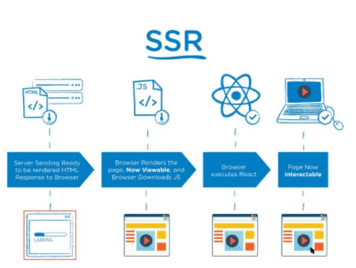
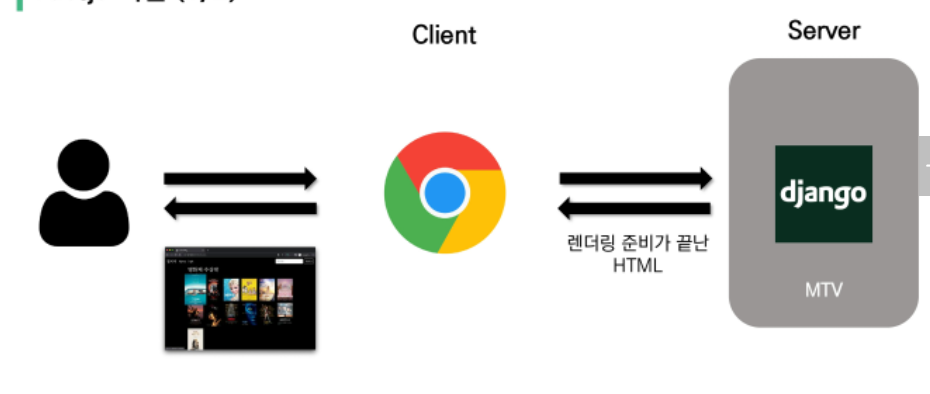
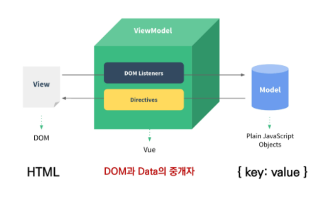
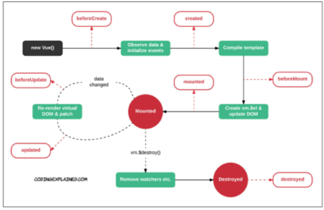

# Vue.js

## Intro

### Front-End Development

- HTML, CSS 그리고 JavaScript를 활용해서 데이터를 볼 수 있게 만들어 줌
  - 이 작업을 통해 사용자(User)는 데이터와 상호작용(Interaction) 할 수 있음
- 대표적인 프론트엔드 프레임워크
  - Vue.js, React, Angular


### Vue.js

- 사용자 인터페이스를 만들기 위한 진보적인 자바스크립트 프레임워크
- 현대적인 tool과 다양한 라이브러리를 통해 SPA(Single Page Application)를 완벽하게 지원


- \[참고\] Evan You에 의해 발표 (2014)
  - 구글의 Angular 개발자 출신
  - 학사 미술, 미술사 전공/ 석사 디자인&테크놀로지 전공
  - 구글 Angular보다 더 가볍고, 간편하게 사용할 수 있는 프레임워크를 만들기 위해 개발


### SPA

- Single Page Application (단일 페이지 애플리케이션)
- 현재 페이지를 동적으로 렌더링함으로써 사용자와 소통하는 웹 애플리케이션

- 단일 페이지로 구성되며 서버로부터 최초에만 페이지를 다운로드하고, 이후에는 동적으로 DOM을 구성
  - 처음 페이지를 받은 이후부터는 서버로부터 새로운 전체 페이지를 불러오는 것이 아닌, 현재 페이지 중 필요한 부분만 동적으로 다시 작성함
- 연속되는 페이지 간의 사용자 경험(UX)을 향상
  - 모바일 사용량이 증가하고 있는 현재 트래픽의 감소와 속도, 사용성, 반응성의 향상으 매우 중요하기 때문
- 동작 원리의 일부가 CSR(Client Side Rendering)의 구조를 따름


### SPA 등장 배경

- 과거 웹 사이트들은 요청에 따라 매번 새로운 페이지를 응답하는 방식이었음
  - MPA (Multi Page Application)
- 스마트폰이 등장하면서 모바일 최적화의 필요성이 대두됨
  - 모바일 네이티브 앱과 같은 형태의 웹 페이지가 필요해짐
- 이러한 문제를 해결하기 위해 Vue.js와 같은 프론트엔드(Front-End) 프레임워크가 등장
  - CSR(Client Side Rendering), SPA(Single Page Application)의 등장
- 1개의 웹 페이지에서 여러 동작이 이루어지며 모바일 앱과 비슷한 형태의 사용자 경험을 제공


### CSR

- Client Side Rendering
- 서버에서 화면을 구성하는 SSR 방식과 달리 클라이언트에서 화면을 구성
- 최초 요청 시 HTML, CSS, JS 등 데이터를 제외한 각종 리소스를 응답받고 이후 클라이언트에서는 필요한 데이터만 요청해 JS로 DOM을 렌더링하는 방식
- 즉, 처음엔 뼈대만 받고 브라우저에서 동적으로 DOM을 그림
- SPA가 사용하는 렌더링 방식


- 장점
  1. 서버와 클라이언트 간 트래픽 감소
     - 웹 애플리케이션에서 필요한 모든 정적 리소스를 최초에 한 번 다운로드 후 필요한 데이터만 갱신
  2. 사용자 경험(UX) 향상
     - 전체 페이지를 다시 렌더링하지 않고 변경되는 부분만을 갱신하기 때문
- 단점
  1. SSR에 비해 전체 페이지 최종 렌더링 시점이 느림
  2. SEO(검색 엔진 최적화)에 어려움이 있음 (최초 문서에 데이터 마크업이 없기 때문)


### SSR

- Server Side Rendering
- 서버에서 클라이언트에게 보여줄 페이지를 모두 구성하여 전달하는 방식
- JS 웹 프레임워크 이전에 사용되던 전통적인 렌더링 방식



- 장점
  1. 초기 구동 속도가 빠름
     - 클라이언트가 빠르게 컨텐츠를 볼 수 있음
  2. SEO(검색 엔진 최적화)에 적합
     - DOM에 이미 모든 데이터가 작성되어있기 때문
- 단점
  - 모든 요청마다 새로운 페이지를 구성하여 전달
    - 반복되는 전체 새로고침으로 인해 사용자 경험이 떨어짐
    - 상대적으로 트래픽이 많아 서버의 부담이 클 수 있음


### SSR & CSR

- 두 방식의 차이는 렌더링의 주최가 누구인가에 따라 결정
- 즉, 실제 브라우저에 그려질(렌더링) HTML을 서버가 만든다면 SSR / 클라이언트가 만든다면 CSR

- SSR과 CSR을 단순 비교하여 '어떤 것이 더 좋다'가 아니라, 내 서비스 또는 프로젝트 구성에 맞는 방법을 적절하게 선택하는 것이 중요

- 예를 들어, Django에서 Axios를 활용한 좋아요/팔로우 로직의 경우 대부분은 Server에서 완성된 HTML을 제공하는 구조 (SSR)

- 단, 특정 요소(좋아요/팔로우)만 JS(AJAX&DOM조작)를 활용 (CSR)
  - AJAX를 활용해 비동기 요청으로 필요한 데이터를 클라이언트에서 서버로 직접 요청을 보내 받아오고 JS를 활용해 DOM을 조작


### \[참고\] SEO

- Search Engine Optimization (검색 엔진 최적화)
- 웹 페이지 검색엔진이 자료를 수집하고 순위를 매기는 방식에 맞게 웹 페이지를 구성해서 검색 결과의 상위에 노출될 수 있도록 하는 작업
- 인터넷 마케팅 방법 중 하나
- 구글의 등장 이후 검색엔진들이 컨텐츠의 신뢰도를 파악하는 기초 지표로 사용됨
  - 다른 웹 사이트에서 얼마나 인용되었나를 반영
  - 결국 타 사이트에 인용되는 횟수를 늘리는 방향으로 최적화


### \[참고\] SEO 대응

- Vue.js 또는 React 등의 SPA 프레임워크는 SSR을 지원하는 SEO 대응 기술이 이미 존재
  - SEO 대응이 필요한 페이지에 대해서는 선별적 SEO 대응 가능
- 혹은 추가로 별도의 프레임워크를 사용하기도 함
  - Nuxt.js
    - Vue.js 응용 프로그램을 만들기 위한 프레임워크
    - SSR 지원
  - Next.js
    - React 응용 프로그램을 만들기 위한 프레임워크
    - SSR 지원


### Vue.js 역할




## Why Vue.js?

### 가장 인기있는 프론트엔드 프레임워크

- 2021년 10월 기준 Organizations Ranking 6위


### 왜 사용할까?

- 현대 웹 페이지는 페이지 규모가 계속해서 커지고 있으며, 그만큼 사용하는 데이터도 늘어나고 사용자와의 상호작용도 많이 이루어짐

- 결국 Vanilla JS 만으로는 관리하기가 어려움
  - 예시) '페이스북 친구가 이름을 수정했을 경우, 화면상에서 변경되어야 하는 것들'
  - 타임라인의 이름, 페이스북 메시지 상의 이름, 내 주소록에서의 친구 이름 등
  - -> 페이스북이 React를 개발한 이유


### 비교

- Vanilla JS
  - 한 유저가 작성한 게시글이 DOM상에 100개 존재
  - 이 유저가 닉네임을 변경하면, DB의 Update와 별도로 DOM상의 100개의 작성자 이름이 모두 수정되어야 함
  - '모든 요소'를 선택해서 '이벤트'를 등록하고 값을 변경해야 함
- Vue.js
  - DOM과 Data가 연결되어 있고
  - Data를 변경하면 이에 연결된 DOM은 알아서 변경
  - 즉, 우리가 신경 써야 할 것은 오직 **Data에 대한 관리 (Developer Exp 향상)**


## Concepts of Vue.js

### MVVM Pattern

- 애플리케이션 로직을 UI로부터 분리하기 위해 설계된 디자인 패턴
- 구성 요소
  1. Model
  2. View
  3. View Model


### MVVM Pattern in Vue.js




### MVVM

- **Model**
  - 'Vue 에서 **Model**은 JavaScript Object다.'
  - Object === { key: value }
  - Model은 Vue Instance 내부에서 **data**라는 이름으로 존재
  - 이 data가 바뀌면 View(DOM)가 반응
- **View**
  - 'Vue에서 **View**는 DOM(**HTML**)이다.'
  - Data의 변화에 따라서 바뀌는 대상
- **ViewModel**
  - 'Vue에서 ViewModel은 모둔 Vue Instance이다.'
  - View와 Model 사이에서 Data와 DOM에 관련된 모든 일을 처리
  - ViewModel을 호라용해 Data를 얼마만큼 잘 처리해서 보여줄 것인지(DOM)를 고민하는 것


## Vue version 2 vs 3

### Official main version === Vue 3

- **Vue 3**
  - 2022년 2월부터 vue 프레임워크의 기본 버전이 3.x로 전환
  - CDN or npm을 통한설치시 자동으로 Vue 3로 설정
- **Vue 2**
  - 실무에서 여전히 Vue 2가 많이 사용됨(legacy code)
  - Vue 2의 생태계(문서, 튜토리얼, 자료, QnA 등)가 더 성숙함
  - 코어/커뮤니티 라이브러리의 호환 역시 Vue 2가 더 안정적
  - **참고자료가 많은 Vue 2로 학습 후, Vue 3로 이전(migration)하는게 가장 효과적**


## Quick Start of Vue.js

### Django & Vue.js 코드 작성 순서

- Django

  - '데이터의 흐름'
  - url -> views -> template

- Vue.js

  - 'Data가 변화하면 DOM이 변경'

  1. Data 로직 작성
  2. DOM 작성


### 공식문서 '시작하기' 따라하기

- CDN 작성

```html
<!-- 1. Vue.js CDN -->
<script src="https://cdn.jsdelivr.net/npm/vue/dist/vue.js"></script>
```


- 선언적 렌더링

```html
<h2>선언적 렌더링</h2>
<div id="app">
    {{ message }}
</div>
```

```html
const app = new Vue({
  el: '#app',
  data: {
	message: '안녕하세요 Vue!'
}
})
```


- Element 속성 바인딩

```html
<h2>Element 속성 바인딩</h2>
  <div id="app2">
    {{ message }}
  </div>
```

```html
const app2 = new Vue({
      el:'#app2',
      data: {
        message: `이 메시지는 ${new Date()} 에 로드됨!`
      }
    })
```


- 조건문 (소스코드에 보이는건 v-show,,,, v-if는 안 보임)

```html
<h2>조건</h2>
  <div id="app3">
    <p v-if="seen">보인다</p>
  </div>
```


```html
const app3 = new Vue({
      el: '#app3',
      data: {
        seen: true,
      }
    })
```


- 반복문

```html
<h2>반복</h2>
  <div id="app4">
    <ol>
        // v-for로 li태그가 반복됨
      <li v-for="todo in todos">
        {{ todo.text }}
      </li>
    </ol>
  </div>
```

```html
const app4 = new Vue({
      el: '#app4',
      data: {
        todos: [
          { text: 'js 복습'},
          { text: 'vue 배우기'},
          { text: '멋지게 만들기'}
        ]
      }
    })
```


- 사용자 입력 핸들링

```html
<h2>사용자 입력 핸들링</h2>
  <div id="app5">
    <p>{{ message }}</p>
    <button v-on:click="reverseMessage">로꾸꺼</button>
  </div>
```

```html
const app5 = new Vue({
      el: '#app5',
      data: {
        message: '안녕하세요'
      },
      methods: {
        reverseMessage: function () {
          this.message = this.message.split('').reverse().join('')
        }
      }
    })
```


```html
<div id="app6">
    <p>
        {{ message }}
    </p>
    <input v-model="message">
</div>
```

```html
const app6 = new Vue({
  el: '#app6',
  data: {
	message: '안녕하세요 Vue!'
}
})
```


## Basic syntax of Vue.js

### Vue instance

- 모든 Vue 앱은 Vue 함수로 새 인스턴스를 만드는 것부터 시작
- Vue 인스턴스를 생성할 때는 Options 객체를 전달해야 함
- 여러 Options들을 사용하여 원하는 동작을 구현
- Vue Instance === Vue Component

```vue
const app = new Vue({

})
```


### Options/DOM - 'el'

- Vue 인스턴스에 연결(마운트) 할 기존 DOM 요소가 필요
- CSS 선택자 문자열 혹은 HTML Element로 작성
- new를 이용한 인스턴스 생성 때만 사용

```vue
const app = new Vue({
  el: '#app'
})
```

```html
<div class = 'app'>

const app = new Vue({
  el: '.app'
})
```

-> 선택할 수 있으면 연결가능

같은 선택자가 2개 이상이면 가장 먼저 있는 element만 연결


### Options/Data - 'data'

- Vue 인스턴스의 데이터 객체
- Vue 인스턴스의 상태 데이터를 정의하는 곳
- Vue template에서 interpolation을 통해 접근 가능
- v-bind, v-on과 같은 directive에서도 사용 가능
- Vue 객체 내 다른 함수에서 this 키워드를 통해 접근 가능
  - this가 window인지 객체인지
    - console.log(this) 찍어보기
  - 메서드 내부에 콜백함수 정의 arrow function 사용

```html
const app = new Vue({
  el: '#app',
  data: {
	message: 'Hello',
}
})
```


### Options/Data - 'methods'

- Vue 인스턴스에 추가할 메서드
- Vue template에서 interpolation을 통해 접근 가능
- v-on과 같은 directive에서도 사용 가능
- Vue 객체 내 다른 함수에서 this 키워드를 통해 접근 가능
- 주의
  - 화살표 함수를 메서드를 정의하는데 사용하면 안 됨
  - 화살표 함수가 부모 컨텍스트를 바인딩하기 때문에, 'this'는 Vue 인스턴스가 아님.

```html
const app = new Vue({
  el: '#app',
  data: {
	messsage: 'Hello',
  },
  methods: {
	greeting: function () {
	  console.log('hello')
    }
  }
})
```


### 'this' keyword in vue.js  // 직접 타이핑해보기!!

- Vue 함수 객체 내에서 vue 인스턴스를 가리킴
- 단, 화살표 함수를 사용하면 안 되는 경우
  1. data
  2. method  정의


## Template Syntax

### Template Syntax

- 렌더링 된 DOM을 기본 Vue 인스턴스의 데이터에 선언적으로 바인딩할 수 있는 HTML 기반 템플릿 구문을 사용

1. Interpolation
2. Directive


### Interpolation (보간법)

1. Text
   - \<span\>메시지: {{ msg }}\</span\>
2. Raw HTML
   - \<span v-html="rawHtml"\>\</span\>
3. Attributes
   - \<div v-bind:id="dynamicId"\>\</div\>
4. JS 표현식
   - {{ number + 1 }}
   - {{ message.split('').reverse().join('') }}


### Directive (디렉티브)

- v-접두사가 있는 특구 속성
- 속성 값은 단일 JS 표현식이 됨 (v-for는 예외)
- 표현식의 값이 변경될 때 반응적으로 DOM에 적용하는 역할을 함

- **전달인자 (Arguments)**

  - \`:\` (콜론)을 통해 전달인자를 받을 수도 있음

  ```html
  <a v-bind:href="url"> ... </a>
  <a v-on:click="doSomething"> ... </a>
  ```

- **수식어 (Modifiers)**
  - \`.\` (점)으로 표시되는 특수 접미사
  - directive를 특별한 방법으로 바인딩 해야 함을 나타냄


### v-text

- 엘리먼트의 textContent를 업데이트
- 내부적으로 interpolation 문법이 v-text로 컴파일 됨

```html
<div id="app">
    <p>{{ message }}</p>
    <p v-text="message"></p>
  </div>
  
  <script src="https://cdn.jsdelivr.net/npm/vue/dist/vue.js"></script>
  <script>
    const app = new Vue({
      el: '#app',
      data: {
        message: 'Hello',
      }
    })
  </script>
```


### v-html

- 엘리먼트의 innerHTML을 업데이트
  - XSS 공격에 취약할 수 있음
- 임의로 사용자로부터 입력 받은 내용은 v-html에 **'절대' 사용 금지**

```html
<div id="app">
    <p>{{ message }}</p>
    <p v-text="message"></p>
    <p v-html="message"></p>
  </div>
  
  <script src="https://cdn.jsdelivr.net/npm/vue/dist/vue.js"></script>
  <script>
    const app = new Vue({
      el: '#app',
      data: {
        message: '<strong>강하닷</strong>'
      }
    })
```


### v-show

- 조건부 렌더링 중 하나
- 요소는 항상 렌더링 되고 DOM에 남아있음
- 단순히 엘리먼트에 display CSS 속성을 토글하는 것

```html
<div id="app">
    <p v-show="isTrue">TRUE</p>
    <p v-show="isFalse">FALSE</p>
  </div>
  
  <script src="https://cdn.jsdelivr.net/npm/vue/dist/vue.js"></script>
  <script>
    const app = new Vue({
      el: '#app',
      data: {
        isTrue: true,
        isFalse: false,
      }
    })
  </script>
```


### v-if, v-else-if, v-else

- 조건부 렌더링 중 하나
- 조건에 따라 요소를 렌더링
- directive의 표현식이 true일 때만 렌더링
- 엘리먼트 및 포함된 directive는 토글하는 동안 삭제되고 다시 작성됨

```html
<div id="app">
    <p v-if="seen">seen is TRUE</p>

    <p v-if="myType === 'A'">A</p>
    <p v-else-if="myType === 'B'">B</p>
    <p v-else-if="myType === 'C'">C</p>
    <p v-else>NOT A/B/C</p>
  </div>

  <script src="https://cdn.jsdelivr.net/npm/vue/dist/vue.js"></script>
  <script>
    const app = new Vue({
      el: '#app',
      data: {
        seen: false,
        myType: 'B',
      }
    })
  </script>
```


### v-show와 v-if

- **v-show (Expensive initial load, cheap toggle)**
  - CSS display 속성을 hidden으로 만들어 토글
  - 실제로 렌더링은 되지만 눈에서 보이지 않는 것이기 때문에 딱 한 번만 렌더링이 되는 경우라면 v-if에 비해 상대적으로 렌더링 비용이 높음
  - 하지만, 자주 변경되는 요소라면 한 번 렌더링 된 이후부터는 보여주는지에 대한 여부만 판단하면 되기 때문에 토글 비용이 적음
- **v-if (Cheap initial load, expensive toggle)**
  - 전달인자가 false인 경우 렌더링 되지 않음
  - 화면에서 보이지 않을 뿐만 아니라 렌더링 자체가 되지 않기 때문에 렌더링 비용이 낮음
  - 하지만, 자주 변경되는 요소의 경우 다시 렌더링 해야 하므로 비용이 증가할 수 있음


### v-for

- 원본 데이터를 기반으로 엘리먼트 또는 템플릿 블록을 여러 번 렌더링
- item in items 구문 사용
- item 위치의 변수를 각 요소에서 사용할 수 있음
  - 객체의 경우는 key
- v-for 사용 시 반드시 **key  속성을 각 요소에 작성**
- v-if와 함께 사용하는 경우 v-for가 우선순위가 더 높음
  - 단, 가능하면 v-if와 v-for를 동시에 사용하지 말 것

```html
<div id="app">
    <div v-for="fruit in fruits">
      {{ fruit }}
    </div>
    <div v-for="(fruit, idx) in fruits" :key="idx">
      {{ idx }} => {{ fruit }}
    </div>
    <div v-for="todo in todos" :key="`todo-${todo.id}`">
      <p>{{ todo.title }} => {{ todo.completed }}</p>
    </div>

  <script src="https://cdn.jsdelivr.net/npm/vue/dist/vue.js"></script>
  <script>
    const app = new Vue({
      el: '#app',
      data: {
        myStr: 'Hello World!',
        fruits: ['apple', 'banana', 'coconut'],
        todos: [
          { id: 1, title: 'todo1', completed: true},
          { id: 2, title: 'todo2', completed: false},
          { id: 3, title: 'todo3', completed: true},
        ],
      }
    })
  </script>
</body>
```


### v-on

- 엘리먼트에 이벤트 리스너를 연결
- 이벤트 유형은 전달인자로 표시함
- 특정 이벤트가 발생했을 때, 주어진 코드가 실행 됨
- 약어 (Shorthand)
  - @
  - v-on:click -> @click

```html
<div id="app">
    <!-- 메서드 핸들러 -->
    <button v-on:click="alertHello">Button</button>
    <button @click="alertHello">Button</button>
    <!-- 기본 동작 방지 -->
    <form action="" @submit.prevent="alertHello">
      <button>GoGo</button>
    </form>

    <!-- 키 별칭을 이용한 키 입력 수식어 -->
    <input type="text" @keyup.enter="log">
    <!-- cb 함수여서 특수문법 () -->
    <input type="text" @keyup.enter="log('ssafy')">
    
    <p>{{ message }}</p>
    <button @click="changeMessage">change message</button>
  </div>
  
  <script src="https://cdn.jsdelivr.net/npm/vue/dist/vue.js"></script>
  <script>
    const app = new Vue({
      el: '#app',
      data: {
        message: 'Hello Vue',
      },
      // 행동(함수)
      methods: {
        alertHello: function () {
          alert('hello')
        },
        log: function (event) {
          console.log(event)
        },
        changeMessage() {
          this.message = 'New message!!'
        },
      }
    })
  </script>
</body>
```


### v-bind

- HTML 요소의 속성에 Vue의 상태 데이터를 값으로 할당
- Object 형태로 사용하면 value가 true인 key가 class 바인딩 값으로 할당
- 약어 (Shorthand)
  - : (콜론)
  - v-bind: href -> :href

```html
<div id="app">
    <!-- 속성 바인딩 -->
    
    

    <hr>

    <!-- 클래스 바인딩 -->
    <div :class="{ active: isRed }">
      클래스 바인딩
    </div>

    <h3 :class="[activeRed, myBackground]">
      hello vue
    </h3>

    <hr>

    <!-- 스타일 바인딩 -->
    <p :style="{ fontSize: fontSize + 'px' }">
      this is paragraph
    </p>
  </div>
  
  <script src="https://cdn.jsdelivr.net/npm/vue/dist/vue.js"></script>
  <script>
    const app = new Vue({
      el: '#app',
      data: {
        fontsize: 16,
        altMsg: 'this is image',
        imageSr: 'https://picsum.photos/200/300/',
        isRed: true,
        activeRed: 'active',
        myBackground: 'my-background-color',
      }
    })
  </script>
```


### v-model

- HTML form 요소의 값과 data를 양방향 바인딩
- 수식어
  - .lazy
    - input 대신 change 이벤트 이후에 동기화
  - .number
    - 문자열을 숫자로 변경
  - .trim
    - 입력에 대한 trim을 진행

```html
<body>
  <div id="app">
    <h2>Input -> Data 단방향</h2>
    <p>{{ msg1 }}</p>
    <input type="text" @input="onInputChange">
    <hr>
    <h2>Input <-> Data 양방향</h2>
    <p>{{ msg2 }}</p>
    <input type="text" v-model="msg2">
    <hr>
    췍! <input id="box" type="checkbox" v-model="checked">
    <label for="box">{{ chekced }}</label>

  </div>

  <script src="https://cdn.jsdelivr.net/npm/vue/dist/vue.js"></script>
  <script>
    const app = new Vue({
      el: '#app',
      data: {
        msg1: '111',
        msg2: '222',
        checked: true,
      },
      methods: {
        onInputChange (event) {
          this.msg1 = event.target.value
        }
      },
    })
  </script>
</body>
```


### Options/Data = 'computed'

- 데이터를 기반으로 하는 계산된 속성
- 함수의 형태로 정의하지만 함수가 아닌 함수의 반환 값이 바인딩 됨
- 종속된 데이터에 따라 저장(캐싱) 됨
- **종속된 데이터가 변경될 때만 함수를 실행**
- 즉, 어떤 데이터에도 의존하지 않는 computed 속성의 경우 절대로 업데이트되지 않음
- 반드시 반환 값이 있어야 함

```html
<body>
  <div id="app">
    <input v-model="r" type="text">
    <p>{{ r }}</p>
    <p>{{ area }}</p>
    <p>{{ perim }} </p>
  </div>
  
  <script src="https://cdn.jsdelivr.net/npm/vue/dist/vue.js"></script>
  <script>
    const app = new Vue({
      el: '#app',
      data: {
        r: 2,
      },
      computed: {
        area: function () {
          return this.r ** 2 * 3.14
        },
        perim: function () {
          return this.r * 2 * 3.14
        },
      }
    })
  </script>
</body>
```


### computed & methods

- computed 속성 대신 methods에 함수를 정의할 수도 있음
  - 최종 결과에 대해 두 가지 접근 방식은 서로 동일
- 차이점은 computed 속성은 종속 대상을 따라 저장(캐싱) 됨
- 즉, computed는 종속된 대상이 변경되지 않는 한 computed에 작성된 함수를 여러 번 호출해도 계산을 다시 하지 않고 계산되어 있던 결과를 반환
- 이에 비해 methods를 호출하면 렌더링을 다시 할 때마다 항상 함수를 실행


### Options/Data - 'watch'

- 데이터를 감시
- 데이터에 변화가 일어났을 때 실행되는 함수

```html
<body>
  <div id="app">
    <p>a: {{ a }}</p>
    <p>Computed: a의 제곱은 {{ square }} 입니다.</p>
    <p>Watch: a는 {{ increase }} 만큼 증가했습니다.</p>
    <input type="number" v-model.number="delta">
    <button @click="a += delta">a 증가</button>
  </div>

  <script src="https://cdn.jsdelivr.net/npm/vue/dist/vue.js"></script>
  <script>
    const app = new Vue({
      el: '#app',
      data: {
        a: 0,
        delta: 0,
        increase: 0,
      },
      computed: {
        square: function () {
          console.log('Computed !')
          return this.a**2
        }
      },
      // a가 변경되면 변경된 값을 콜백함수의 첫번째 인자로 전달하고 이전 값을 두번째 인자로 전달
      // computed는 새 프로퍼티를 생성하지만 watch는 아무 프로퍼티도 생성하지 않고 익명함수는 단순히 콜백함수 역할만 함
      // watch에 명시된 프로퍼티는 감시할 대상을 의미할 뿐임
      // 특정 data의 변경에 맞춰서
      watch: {
        a: function (newValue, oldValue) {
          console.log('Watch !')
          this.increase = newValue - oldValue
        }
      }
    })
  </script>
</body>
```


### computed & watch

- **computed**
  - 특정 데이터를 직접적으로 사용/가공하여 다른 값으로 만들 때 사용
  - 속성은 계산해야 하는 목표 데이터를 정의하는 방식으로 소프트웨어 공학에서 이야기하는 '선언형 프로그래밍' 방식
- **watch**
  - 특정 데이터의 변화 상황에 맞춰 다른 data 등이 바뀌어야 할 때 주로 사용
  - 감시할 데이터를 지정하고 그 데이터가 바뀌면 특정 함수를 실행하는 방식
  - 소프트웨어 공학에서 이야기하는 '명령형 프로그래밍' 방식


- **computed**
  - '특정 값이 변동하면 해당 값을 다시 계산해서 보여준다.'
- **watch**
  - '특정 값이 변동하면 다른 작업을 한다.'
  - 특정 대상이 변경되었을 때 콜백 함수를 실행시키기 위한 트리거


- computed와 watch는 어떤 것이 더 우수한 것이 아닌 사용하는 목적과 상황이 다름


### 선언형&명령형

- 선언형 프로그래밍
  - '계산해야 하는 목표 데이터를 정의' (computed)
- 명령형 프로그래밍
  - '데이터가 바뀌면 특정 함수를 실행해!' (watch)


### Options/Assets - 'filter'

- 텍스트 형식화를 적용할 수 있는 필터
- interpolation 혹은 v-bind를 이용할 때 사용 가능
- 필터는 자바스크립트 표현식 마지막에 '|' (파이프)와 함꼐 추가되어야 함
- 이어서 사용(chaining) 가능

```html
<body>
  <div id="app">
    {{ numbers | getOddNumbers | getUnderTen }}
    {{ getOddAndUnderTen }}
  </div>

  <script src="https://cdn.jsdelivr.net/npm/vue/dist/vue.js"></script>
  <script>
    const app = new Vue({
      el: '#app',
      data: {
        numbers: [1, 2, 3, 4, 5, 6, 7, 8, 9, 10, 11, 12, 13, 14, 15],
      },
      filters: {
        getOddNumbers(array) {
          return array.filter(num => num % 2)
        },
        getUnderTen(array) {
          return array.filter(num => num < 10)
        }
      },
      // computed
      computed: {
        getOddAndUnderTen() {
          this.numbers.filter(num => num % 2 && num < 10)
        }
      }
    })
  </script>
</body>
```


## Lifecycle Hooks

### Lifecycle Hooks

- 각 Vue 인스턴스는 생성될 때 일련의 초기화 단계를 거침
  - 예를 들어 데이터 관찰 설정이 필요한 경우, 인스턴스를 DOM에 마운트하는 경우, 데이터가 변경되어 DOM를 업데이트하는 경우 등
- 그 과정에서 사용자 정의 로직을 실행할 수 있는 Lifecycle Hooks도 호출됨
- 공식문서를 통해 각 라이프사이클 훅의 상세 동작을 참고


### Lifecycle Hooks 예시

- 예를 들어 created hook은 vue 인스턴스가 생성된 후에 호출 됨

```html
<script>
  new Vue({
	data: {
	  a: 1
    },
	created: function () {
	  console.log('a is: ' + this.a)  // => 'a is: 1'
    }
  })
</script>
```

- created를 사용해 애플리케이션의 초기 데이터를 API 요청을 통해 불러올 수 있음

```html
<body>
  <div id="app">
    
    <button @click="getImg">GetDog</button>
  </div>
  
  <script src="https://cdn.jsdelivr.net/npm/axios/dist/axios.min.js"></script>
  <script src="https://cdn.jsdelivr.net/npm/vue/dist/vue.js"></script>
  <script>
    const API_URL = 'https://dog.ceo/api/breeds/image/random'
    const app = new Vue({
      el: '#app',
      data: {
        imgSrc: '',
      },
      methods: {
        getImg: function () {
          axios.get(API_URL)
            .then(response => {
              this.imgSrc = response.data.message
            })
        }
      },
      // 외부 API에서 초기 데이터 받아오기
      // Vue 인스턴스가 생성되면 getImg() 함수를 호출해 처음부터 이미지 데이터를 불러옴
      created: function() {
        this.getImg()
      }
    })
  </script>
</body>
```

