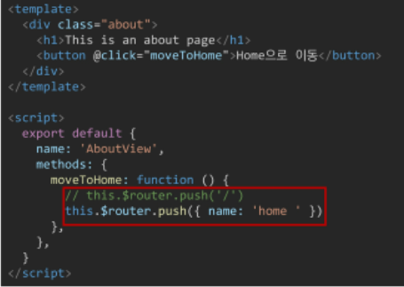

## Vue CLI

## SFC

### Component (컴포넌트)

- 기본 HTML 엘리먼트를 확장하여 재사용 가능한 코드를 캡슐화 하는데 도움을 줌
- CS에서는 다시 사용할 수 있는 범용성을 위해 개발된 소프트웨어 구성 요소를 의미
- 즉, 컴포넌트는 유지보수를 쉽게 만들어 줄 뿐만 아니라, 재사용성의 측면에서도 매우 강력한 기능을 제공

*Vue 컴포넌트 === Vue 인스턴스*


### SFC (Single File Component)

- Vue의 컴포넌트 기반 개발의 핵심 특징
- 하나의 컴포넌트는 .vue 확장자를 가진 하나의 파일 안에서 작성되는 코드의 결과물
- 화면의 특정 영역에 대한 HTML, CSS, JavaScript 코드를 하나의 파일(.vue)에서 관리
- 즉, .vue 확장자를 가진 싱글 파일 컴포넌트를 통해 개발하는 방식

*Vue 컴포넌트 === Vue 인스턴스 === .vue 파일*


### Component 예시 - 단일 파일 관리

- 단일 파일에서의 개발
  - 처음 개발을 시작 할 때는 크게 신경 쓸 것이 없기 때문에 쉽게 개발 가능
  - 하지만 코드의 양이 많아지면 변수 관리가 힘들어지고 유지보수에 많은 비용 발생


### Component 예시 - 한 화면을 구성하는 여러 컴포넌트

- 각 기능 별로 파일을 나눠서 개발
  - 처음 개발을 준비하는 단계에서 시간 소요가 증가
  - 하지만 이후 변수 관리가 용이하며 기능 별로 유지&보수 비용 감소


### Vue Component 구조 예시


- 한 화면 안에서도 기능 별로 각기 다른 컴포넌트가 존재

  - 하나의 컴포넌트는 여러 개의 하위 컴포넌트를 가질 수 있음
  - Vue는 컴포넌트 기반의 개발 환경 제공

- Vue 컴포넌트는 const app = new Vue({...})의 app을 의미하며 이는 Vue 인스턴스

  - 여기서 오해하면 안 되는 것은 컴포넌트 기반의 개발이

    반드시 파일 단위로 구분되어야 하는 것은 아님

  - 단일 .html 파일 안에서도 여러 개의 컴포넌트를 만들어 개발 가능


### 정리

- Vue 컴포넌트는 Vue 인스턴스(new Vue( {} ))이기도 함
- Vue 인스턴스는 .vue 파일 안에 작성된 코드의 집합
- HTML, CSS, 그리고 JavaScript를 .vue라는 확장자를 가진 팡리 안에서 관리하며 개발


## Vue CLI

### Vue CLI

- Vue.js 개발을 위한 표준 도구
- 프로젝트의 구성을 도와주는 역할을 하며 Vue 개발 생태계에서 표준 tool 기준을 목표로 함
- 확장 플러그인, GUI, Babel등 다양한 tool 제공


### Node.js

- 자바스크립트를 브라우저가 아닌 환경에서도 구동할 수 있도록 하는 자바스크립트 런타임 환경
  - 브라우저 밖을 벗어 날 수 없던 자바스크립트 언어의 태생적 한계를 해결
- Chrome V8 엔진을 제공하여 여러 OS 환경에서 실행할 수 있는 환경을 제공
- 즉, 단순히 브라우저만 조작할 수 있던 자바스크립트를 SSR 아키텍처에서도 사용할 수 있도록 함

- \[참고\] 2009년 Ryan Dahl에 의해 발표


### NPM (Node Package Manage)

- 자바스크립트 언어를 위한 패키지 관리자
  - Python에 pip가 있다면 Node.js에는 NPM
  - pip와 마찬가지로 다양한 의존성 패키지를 관리
- Node.js의 기본 패키지 관리자
- Node.js 설치 시 함께 설치됨


### Vue CLI Quick Start

- 설치

  ```bash
  $ npm install -g @vue/cli
  ```

- 버전 확인

  ```bash
  $ vue --version
  ```


vscode terminal로 진행

- 프로젝트 생성

  ```bash
  $ vue create my-first-app
  ```

- npm 레지스트리 변경(환경에 따라 나오지 않을 수 있음)

  ```bash
  ? Your connection to the default npm registry seems to be slow.
    Use https://registry.npm.taobao.org for faster installation? Yes
  ```

- Vue 버전 선택 (Vue 2)

- 프로젝트 생성 성공

  ```bash
  ...
  
  $ cd my-first-app
  $ npm run serve
  ```

- 프로젝트 디렉토리 이동

  ```bash
  $ cd my-first-app

- 서버 실행

  ```bash
  $ npm run serve
  ```

  


## Babel & Webpack

### Babel

- 'JavaScript compiler'
- 자바스크립트의 ECMAScript 2015+ 코드를 이전 버전으로 번역/변환해주는 도구
- 과거 자바스크립트의 파편화와 표준화의 영향으로 코드의 스펙트럼이 매우 다양
  - 이 떄문에 최신 문법을 사용해도 이전 브라우저 혹은 환경에서 동작하지 않는 상황이 발생
- 원시 코드(최신 버전)를 목적 코드(구 버전)로 옮기는 번역기가 등장하면서 개발자는 더 이상 내 코드가 특정 브라우저에서 동작하지 않는 상황에 대해 크게 고민하지 않을 수 있게 됨


### Babel 동작 예시

```javascript
// Babel Input: ES2015 arrow function / 원시 코드(ES6+)
[1, 2, 3].map((n) => n + 1);

// Babel Output: ES5 equivalent / 목적 코드(ES5)
[1, 2, 3].map(function(n) {
    return n + 1;
});
```


### Webpack

- 'static module bundler'
- 모듈 간의 의존성 문제를 해결하기 위한 도구
- 프로젝트에 필요한 모든 모듈을 매핑하고 내부적으로 종속성 그래프를 빌드함


### Static 'Module' Bundler

- 모듈은 단지 파일 하나를 의미 (ex. js 파일 하나 === 모듈 하나)
- 배경
  - 브라우저만 조작할 수 있었던 시기의 자바스크립트는 모듈 관련 문법 없이 사용 됨
  - 하지만 JS와 애플리케이션이 복잡해지고 크기가 커지자 전역 scope를 공유하는 형태의 기존 개발 방식의 한계점이 드러남
  - 그래서 라이브러리를 만들어 필요한 모듈을 언제든지 불러오거나 코드를 모듈 단위로 작성하는 등의 다양한 시도가 이루어짐

- 여러 모듈 시스템
  - **ESM(ECMA Script Module)**
  - AMD(Asynchronous Module Definition)
  - CommonJS
  - UMD(Universal Module Definition)


### Module 의존성 문제

- 모듈의 수가 많아지고 라이브러리 혹은 모듈 간의 의존성(연결성)이 깊어지면서 특정한 곳에서 발생한 문제가 어떤 모듈 간의 문제인지 파악하기 어려움
- 즉, Webpack은 이 모듈 간의 의존성 문제를 해결하기 위해 등장


### Static Module 'Bundler'

- 모듈 의존성 문제를 해결해주는 작업을 Bundling이라 함
- 이러한 일을 해주는 도구가 Bundler이고, Webpack은 다양한 Bundler 중 하나
- 여러 모듈을 하나로 묶어주고 묶인 파일은 하나(혹은 여러 개)로 합쳐짐
- Bundling된 결과물은 더 이상 순서에 영향을 받지 않고 동작하게 됨
- snowpack, parcel, rollup.js 등의 webpack 이외에도 다양한 모듈 번들러 존재
- **Vue CLI는 이러한 Babel, Webpack에 대한 초기 설정이 자동으로 되어 있음**


### node_module의 의존성 깊이


### Webpack


### 정리

- Node.js
  - JavaScript Runtime Environment
  - JavaScript를 브라우저 밖에서 실행할 수 있는 새로운 환경
- Babel
  - Compiler
  - ES2015+ JavaScript 코드를 구 버전의 JavaScript로 바꿔주는 도구
- Webpack
  - Module Bundler
  - 모듈 간의 의존성 문제를 해결하기 위한 도구


### Vue 프로젝트 구조

- node_modules
  - node.js 환경의 여러 의존성 모듈
- public/index.html
  - Vue 앱의 뼈대가 되는 파일
  - 실제 제공되는 단일 html 파일
- src/assets
  - webpack에 의해 빌드 된 정적 파일
- src/components
  - 하위 컴포넌트들이 위치
- src/App.vue
  - 최상위 컴포넌트
- src/main.js
  - webpack이 빌드를 시작할 때 가장 먼저 불러오는 entry point
  - 실제 단일 파일에서 DOM과 data를 연결했던 것과 동일한 작업이 이루어지는 곳
  - Vue 전역에서 활용 할 모듈을 등록할 수 있는 파일
- babel.config.js
  - babel 관련 설정이 작성된 파일
- package.json
  - 프로젝트의 종속성 목록과 지원되는 브라우저에 대한 구성 옵션이 포함
- package-lock.json
  - node_modules에 설치되는 모듈과 관련된 모든 의존성을 설정 및 관리
  - 팀원 및 배포 환경에서 정확히 동일한 종속성을 설치하도록 보장하는 표현
  - 사용할 패키지의 버전을 고정
  - 개발 과정 간의 의존성 패키지 충돌 방지


## Pass Props & Emit Events

### 컴포넌트 작성

- Vue app은 자연스럽게 중첩된 컴포넌트 트리로 구성됨
- 컴포넌트간 부모-자식 관계가 구성되며 이들 사이에 필연적으로 의사 소통이 필요함

- 부모는 자식에게 데이터를 전달(Pass props)하며,

  자식은 자신에게 일어난 일을 부모에게 알림(Emit event)

  - 부모와 자식이 명확하게 정의된 인터페이스를 통해 격리된 상태를 유지할 수 있음

- "props는 아래로, events는 위로"

- 부모는 props를 통해 자식에게 '데이터'를 전달하고, 자식은 events를 통해 부모에게 '메시지'를 보냄


### 컴포넌트 구조

1. 템플릿 (HTML)

   ```vue
   <templates>
   <div id="app">
       
       <HelloWorld msg="Welcome to Your Vue.js App"/>
     </div>
   </templates>
   ```

   - HTML의 body 부분
   - 각 컴포넌트를 작성


2. 스크립트 (JavaScript)

   ```vue
   <script>
   import HelloWorld from './components/HelloWorld.vue'
   
   export default {
   	name: 'App',
   	components: {
   		HelloWorld
       }
   }
   </script>
   ```

   - JavaScript가 작성되는 곳
   - 컴포넌트 정보, 데이터, 메서드 등 vue 인스턴스를 구성하는 대부분이 작성됨


3. 스타일 (CSS)

   ```vue
   <style>
   #app {
     font-family: Avenir, Helvetica, Arial, sans-serif;
     -webkit-font-smoothing: antialiased;
     -moz-osx-font-smoothing: grayscale;
     text-align: center;
     color: #2c3e50;
     margin-top; 60px;
    }
    </style>
   ```

   - CSS가 작성되며 컴포넌트의 스타일을 담당


### 컴포넌트 등록 3단계

1. 불러오기 (import)
2. 등록하기 (register)
3. 보여주기 (print)


### Pass Props & Emit Events


### Props

- props는 부모(상위) 컴포넌트의 정보를 전달하기 위한 사용자 지정 특성
- 자식(하위) 컴포넌트는 props 옵션을 사용하여 수신하는 props를 명시적으로 선언해야 함
- 즉, 데이터는 props 옵션을 사용하여 자식 컴포넌트로 전달됨

- 주의
  - 모든 컴포넌트 인스턴스에는 자체 격리된 범위가 있음
  - 즉, 자식 컴포넌트의 템플릿에서 상위 데이터를 직접 참조할 수 없음


### Static Props 작성

- 자식 컴포넌트(About.vue)에 보낼 prop 데이터 선언

- 작성법

  - prop-data-name="value"

    내려보낼 이름-케밥 케이스

```vue
// App.vue

<template>
  <div id="app">
      
      <about my-message="This is prop data"></about>
  </div>
</template>
```


- 수신 할 prop 데이터를 명시적으로 선언 후 사용

```vue
// About.vue

<template>
<div>
    <h1>About</h1>
    <h2>{{ myMessage }}</h2>
    </div>
</template>

<script>
export default {
  name: 'About',
  props: {
	myMessage: String,
  }
}
</script>
```


### Dynamic Props 작성

- v-bind directive를 사용해 부모의 데이터의 props를 동적으로 바인딩
- 부모에서 데이터가 업데이트 될 때마다 자식 데이터로도 전달 됨

```vue
// App.vue

<template>
  <div id="app">
    
    <about
       my-message="This is prop data"
       :parent-data="parentData"
      >
    </about>
  </div>
</template>

<script>
import AboutView from './components/AboutView.vue'

export default {
  name: 'App',
  components: {
    AboutView
  },
  data: function(){
    return {
      parentData: 'This is parent Data by v-bind',
    }
  },
}
</script>
```


- 마찬가지로 수신 할 prop 데이터를 명시적으로 선언 후 사용

```vue
// About.vue

<template>
  <div>
    <h1>About</h1>
    <h2>{{ myMessage }}</h2>
	<h2>{{ parentData }}</h2>
  </div>
</template>

<script>
export default {
  name: 'About',
  props: {
    myMessage: String,
      parentData: STring,
  },
}
</script>
```


### Props 이름 컨벤션

- during declaration (선언 시)
  - camelCase
- in template (HTML)
  - kebab-case


### 컴포넌트의 'data'는 반드시 함수여야 함

- 기본적으로 각 인스턴스는 모두 같은 data 객체를 공유하므로 새로운 data 객체를 반환(return) 해야 함

```vue
data: function() {
  return {
	myData: null,
  }
},
```


### Props 시 자주하는 실수

- Static 구문을 사용하여 숫자를 전달하려고 시도하는 것
- 실제 JavaScript 숫자를 전달하려면 값이 JavaScript 표현식으로 평가되도록 v-bind를 사용해야함

```vue
<!-- 이것은 일반 문자열 "1"을 전달합니다. -->
<comp some-prop="1"></comp>

<!-- 이것은 실제 숫자로 전달합니다. -->
<comp :some-prop="1"></comp>
```


### 단방향 데이터 흐름

- 모든 props는 하위 속성과 상위 속성 사이의 단방향 바인딩을 형성
- 부모의 속성이 변경되면 자식 속성에게 전달되지만, 반대 방향으로는 안 됨
  - 자식 요소가 의도치 않게 부모 요소의 상태를 변경하여 앱의 데이터 흐름을 이해하기 어렵게 만드는 일을 방지
- 부모 컴포넌트가 업데이트 될 때마다 자식 요소의 모든 prop들이 최신 값으로 업데이트됨


### Emit event

- 'Listening to Child Components Events'

- $emit(eventname)
  - 현재 인스턴스에서 이벤트를 트리거
  - 추가 인자는 리스너의 콜백 함수로 전달

- 부모 컴포넌트는 자식 컴포넌트가 사용되는 템플릿에서 v-on을 사용하여 자식 컴포넌트가 보낸 이벤트를 청취(v-on을 이용한 사용자 지정 이벤트)


### Emit event 작성

- 현재 인스턴스에서 $emit 인스턴스 메서드를 사용해  child-input-change 이벤트를 트리거

```vue
// About.vue

<template>
  <div>
    <h1>About</h1>
      <h2>{{ myMessage }}</h2>
      <h2>{{ parentData }}</h2>
      <input
           type="text"
           @keyup.enter="childInputChange"
           v-model="childInputData">
  </div>
</template>

<script>
export default {
  name: 'About',
  data: function () {
      return {
          childInputData: null,
      }
  },
   props:{
    myMessage: String,
    parentData: String,
    },
    methods: {
        childInputChange: function () {
            this.$emit'child-input-change', this.childInputData
      }
  }
}
</script>
```


- 부모 컴포넌트(App.vue)는 자식 컴포넌트(About.vue)가 사용되는 템플릿에서 v-on directive를 사용하여 자식 컴포넌트가 보낸 이벤트(child-input-change)를 청취

  ```vue
  // App.vue
  <about
         @child-input-change="parentGetChagne"
         ></about>
  ```

  


### event 이름 컨벤션

- 컴포넌트 및 props와는 달리, 이벤트는 자동 대소문자 변환을 제공하지 않음
- HTML의 대소문자 구분을 위해 DOM 템플릿의 v-on 이벤트 리스너는 항상 자동으로 소문자 변환되기 때문에 v-on:myEvent는 자동으로 v-on:myevent로 변환

- 이러한 이유로 이벤트 이름에는 항상 kebab-case를 사용하는 것을 권장

  ```vue
  this.$emit('myEvent')
  ```

  ```vue
  <!-- 이벤트가 동작하지 않음 -->
  <my-component @my-event="doSomethign"><</my-component>
  ```

  


## Vue Router

- 'Vue.js 공식 라우터'
- 라우트(route)에 컴포넌트를 매핑한 후, 어떤 주소에서 렌더링 할 지 알려줌
- SPA 상에서 라우팅을 쉽게 개발할 수 있는 기능을 제공

- \[참고\] router
  - 위치에 대한 최적의 경로를 지정하며, 이 경로를 따라 데이터를 다음 장치로 전향시키는 장치


### Vue Router 시작하기

1. 프로젝트 생성 및 이동

   ```bash
   $ vue create my-router-app
   $ cd my-router-app
   ```

2. Vue Router plugin 설치 (Vue CLI 환경)

   ```bash
   $ vue add router
   ```

3. commit 여부 (Yes)

4. History mode 사용 여부 (Yes)


### Vue Router로 인한 변화

1. App.vue 코드
2. router/index.js 생성
3. views 디렉토리 생성


### Vue Router = 'index.js'

- 라우트에 관련된 정보 및 설정이 작성 되는 곳

  ```vue
  import Vue from 'vue'
  import VueRouter from 'vue-router'
  import HomeView from '../views/HomeView.vue'
  
  Vue.use(VueRouter)
  
  cosnt routes = [
    {
  	path: '/',
  	name: 'home',
  	component: HomeView
  },
  {
    path: '/about',
    name: 'about',
    component: () => import('../views/AboutView.vue')
  }
  ]
  
  ```


### Vue Router-"router-link"

- \<router-link\>

  - 사용자 네비게이션을 가능하게 하는 컴포넌트
  - 목표 경로는 'to' prop으로 지정됨
  - HTML5 히스토리 모드에서 router-link는 클릭 이벤트를 차단하여 브라우저가 페이지를 다시 로드하지 않도록 함
  - a 태그지만 우리가 알고 있는 GET 요청을 보내는 a 태그와 조금 다르게, 기본 GET 요청을 보내는 이벤트를 제거한 형태로 구성됨

  ```vue
  <router-link to="/">Home</router-link>
  <router-link to="/about">About</router-link>
  ```


### Vue Router-"router-view"

- \<rouver-view\>

  - 주어진 라우트에 대해 일치하는 컴포넌트를 렌더링하는 컴포넌트
  - 실제 component가 DOM에 부착되어 보이는 자리를 의미
  - router-link를 클릭하면 해당 경로와 연결되어 있는 index.js에 정의한 컴포넌트가 위치

  ```vue
  <router-view/>
  ```


### History mode

- HTML History API를 사용해서 router를 구현한 것
- 브라우저의 히스토리는 남기지만 실제 페이지는 이동하지 않는 기능을 지원
- 즉, 페이지를 다시 로드하지 않고 URL을 탐색할 수 있음
  - SPA의 단점 중 하나인 'URL이 변경되지 않는다.'를 해결


### \[참고\] History API

- DOM의 Window 객체는 history 객체를 통해 브라우저의 세션 기록에 접근할 수 있는 방법을 제공
- history 객체는 사용자를 자신의 방문 기록 앞과 뒤로 보내거나, 기록의 특정 지점으로 이동하는 등 유용한 메서드와 속성을 가짐


### 1. Named Routes

- 이름을 가지는 라우트
- 명명된 경로로 이동하려면 객체를 vue-router 컴포넌트 요소의 prop에 전달


### 2. 프로그래밍 방식 네비게이션

- \<router-link\>를 사용하여 선언적 탐색을 위한 a 태그를 만드는 것 외에도, router의 인스턴스 메서드를 사용하여 프로그래밍 방식으로 같은 작업을 수행할 수 있음

  |         선언적         |  프로그래밍 방식  |
  | :--------------------: | :---------------: |
  | \<router-link to="..." | $router.push(...) |

- Vue 인스턴스 내부에서 라우터 인스턴스에 $router로 접근할 수 있음

- 따라서 다른 URL로 이동하려면 this.$router.push를 호출할 수 있음

  - 이 메서드는 새로운 항목을 히스토리 스택에 넣기 때문에 사용자가 브라우저의 뒤로 가기 버튼을 클릭하면 이전 URL로 이동하게 됨

- \<router-link\>를 클릭할 때 내부적으로 호출되는 메서드이므로 \<router-link :to="..."\>를 클릭하면, router.push(...)를 호출하는 것과 같음

- 작성할 수 있는 인자 예시

  ```vue
  // literal string path
  router.push('home')
  
  //object
  router.push({ path: 'home' })
  
  // named route
  router.push({ name: 'user', params: { userId: '123' } })
  
  // with query, resulting in /register?plan=private
  router.push({ path: 'register', query: { plan: 'private' } })
  ```

- About에서 Home으로 이동하는 로직 작성

  


### 3. Dynamic Route Matching

- 동적 인자 전달

- 주어진 패턴을 가진 라우트를 동일한 컴포넌트에 매핑해야 하는 경우

- 예를 들어 모든 User에 대해 동일한 레이아웃을 가지지만, 다른 User ID로 렌더링 되어야하는 User 컴포넌트 예시

  ```vue
  const routes = [
    {
  	path: '/user/:userId',
  	name: 'User',
  	component: User
    },
  ]
  ```

- 동적 인자는 :(콜론)으로 시작

- 컴포넌트에서 this.$route.params로 사용가능

| pattern                            | matched path          | $route.params                      |
| ---------------------------------- | --------------------- | ---------------------------------- |
| /user/:userName                    | /user/john            | { username: 'john' }               |
| /user/:userName/article/:articleId | /user/john/article/12 | { username: 'john', articleId: 12} |


### components와 views

- 기본적으로 작성된 구조에서 components 폴더와 views 폴더 내부에 각기 다른 컴포넌트가 존재하게 됨
- 컴포넌트를 작성해 갈 때 정해진 구조가 있는 것은 아니며, 주로 아래와 같이 구조화하여 활용함
- App.vue
  - 최상위 컴포넌트
- views/
  - router(index.js)에 매핑되는 컴포넌트를 모아두는 폴더
  - ex) App 컴포넌트 내부에 AboutView&HomeView 컴포넌트 등록
- components/
  - router에 매핑된 컴포넌트 내부에 작성하는 컴포넌트를 모아두는 폴더
  - ex) Home 컴포넌트 내부에 HelloWorld 컴포넌트 등록


### Vue Router가 필요한 이유

1. SPA 등장 이전
   - 서버가 모든 라우팅을 통제
   - 요청 경로에 맞는 HTML를 제공
2. SPA 등장 이후
   - 서버는 index.html 하나만 제공
   - 이후 모든 처리는 HTML 위에서 JS 코드를 활용해 진행
   - 즉, 요청에 대한 처리를 더 이상 서버가 하지 않음 (할 필요가 없어짐)
3. 라우팅 처리 차이
   - SSR
     - 라우팅에 대한 결정권을 서버가 가짐
   - CSR
     - 클라이언트는 더 이상 서버로 요청을 보내지 않고 응답받은 HTML 문서안에서 주소가 변경되면 특정 주소에 맞는 컴포넌트를 렌더링
     - 라우팅에 대한 결정권을 클라이언트가 가짐
   - 결국  Vue Router는 라우팅의 결정권을 가진 Vue.js에서 라우팅을 편리하게 할 수 있는 Tool을 제공해주는 라이브러리


## Youtube Project

### Youtube Project 컴포넌트 관계


### 1. 프로젝트 준비

- 프로젝트 생성 및 lodash 설치

  ```bash
  $ vue create youtube-project
  $ cd youtube-project
  $ npm i lodash
  ```


### 2.1 유튜브 검색 데이터 (TheSearchBar.vue)

- 컴포넌트 등록

  ```vue
  // App.vue
  
  ```


### 2.2 유튜브 검색 데이터 (TheSearchBar.vue)

- Emit Event (TheSearchBar.vue -> App.vue)

  ```vue
  // TheSearchBar.vue
  
  
  ```

  

### 2.3 유튜브 검색 데이터 (TheSearchBar.vue)

- 이벤트 청취 후 함께 전달 된 데이터 할당

  ```vue
  // App.vue
  
  ```


### 3.1 유튜브 요청 & 응답 데이터 처리 (App.vue)

- API_KEY, API_URL 할당
- Youtube API 요청 & 응답 데이터를 변수에 할당


### 3.2 유튜브 요청 & 응답 데이터 처리 (App.vue)

- Pass props (App.vue -> VideoList.vue)

- 할당 한 응답 데이터를 하위 컴포넌트로 전달

  ```vue
  // App.vue
  
  
  ```


### 3.3 유튜브 요청&응답 데이터 처리(App.vue)

- 내려받은 prop 데이터 선언 후 사용

  ```vue
  // VideoList.vue
  
  
  ```


### 3.4 유튜브 요청&응답 데이터 처리(App.vue)

- Pass props (VideoList.vue -> VideoListItem.vue)

  ```vue
  // VideoList.vue
  
  
  ```

  

### 3.5 유튜브 요청&응답 데이터 처리(App.vue)

- 내려받은 prop 데이터(개별 비디오 객체) 선언 후 사용

  ```vue
  // VideoListItem.vue
  
  ```


### 4.유튜브 영상 상세 정보 - VideoDetail.vue

- 유튜브 상세 영상 정보 알리기

  - VideoListItem.vue -> VideoList.vue

  ```vue
  // VideoListItem.vue
  
  
  ```

  ```vue
  // VideoList.vue
  
  ```

  

  - VideoList.vue -> App.vue

  ```vue
  // App.vue
  ```


- App 컴포넌트에서 내린 데이터가 VideoDetail에 전달 되었는지 확인

  ```vue
  // App.vue
  
  ```


- 유튜브 상세 영상 정보 알리기

  - App.vue -> VideoDetail.vue

  ```vue
  // VideoDetail.vue
  
  
  ```


- VideoDetail 컴포넌트 마무리

- Youtube iframe 문서를 참고하여 videoId 값 찾기

  ```vue
  // videoDetail.vue
  
  
  ```

  

### 5.1 Environment Variable

- API 키 환경변수 설정

  ```local
  // .env.local
  VUE_APP_YOUTUBE_API_KEY=~~~
  ```

  ```vue
  // App.vue
  
  ...
  import TheSearchBar from './components/TheSearchBar.vue'
  
  const API_KEY = process.env.VUE_APP_YOUTUBE_API_KEY
  ```


### 5.2 Environment Variable

- 프로젝트 최상단에 배치하여 환경 변수를 지정할 수 있음
- 'NODE_ENV', 'BASE_URL' 및 'VUE_APP_'로 시작하는 변수만 클라이언트 번들에 정적으로 포함됨
- .env.local 에 작성하는 환경 변수는 개발 단계에서 원격 저장소에 노출시키지 않기 위해 git에서 무시되며, 모든 경우에 로드하기 위해 사용
- 단, 환경 변수는 빌드에 포함되므로 누구나 앱 파일을 검사하여 볼 수 있으며, 실제 배포 단계에서는 배포 서비스에 이러한 환경 변수를 설정할 수 있도록 환경을 제공함


- \[참고\] 환경 변수

  - 컴퓨터에서 동작하는 방식에 영향을 미치는, 동적인 값들의 모임

  - 시스템의 실행 파일이 놓여 있는 디렉토리의 경로 등

    운영체제 상에서 동작하는 응용 프로그램이 참조하기 위한 설정이 기록됨