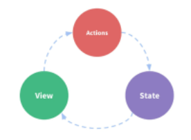
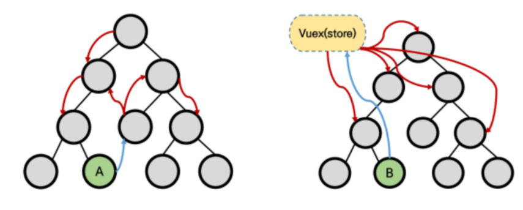
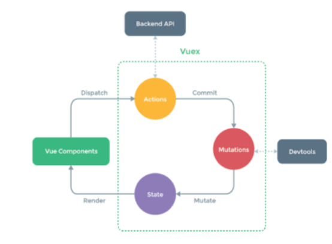
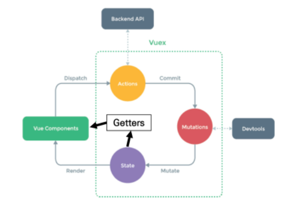
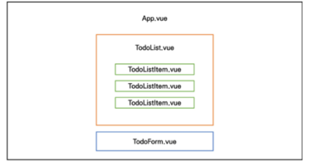
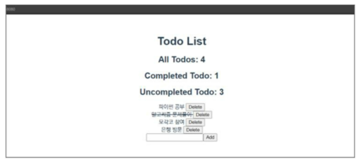
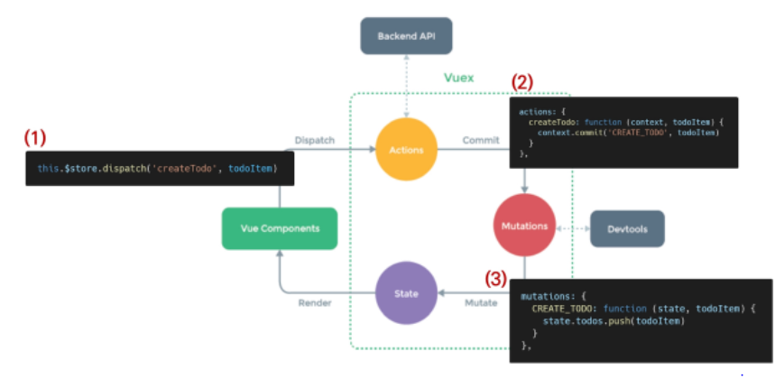

# Vuex

## Vuex Intro

### Vuex

- 'Statement management pattern + Library' for vue.js
  - 상태 관리 패턴 + 라이브러리
- 상태(state)를 전역 저장소로 관리할 수 있도록 지원하는 라이브러리
  - 상태가 예측 가능한 방식으로만 변경될 수 있도록 보장하는 규칙 설정
  - 애플리케이션의 모든 컴포넌트에 대한 **중앙 집중식 저장소** 역할
- Vue의 공식 devtools와 통합되어 기타 고급 기능을 제공


### State

- state는 곧 data이며 해당 애플리케이션의 핵심이 되는 요소
- 중앙에서 관리하는 모든 상태 정보


### 상태 관리 패턴

- 컴포넌트의 공유된 상태를 추출하고 이를 전역에서 관리 하도록 함
- 컴포넌트는 커다란 view가 되며 모든 컴포넌트는 트리에 상관없이 상태에 액세스하거나 동작을 트리거 할 수 있음
- 상태 관리 및 특정 규칙 적용과 관련된 개념을 정의하고 분리함으로써 코드의 구조와 유지 관리 기능 향상

- \[참고\] 트리거
  - 특정한 동작에 반응해 자동으로 필요한 동작을 실행하는 것


### 기존 Pass props & Emit event

- 각 컴포넌트는 독립적으로 데이터를 관리
- 데이터는 단방향 흐름으로 부모 -> 자식 간의 전달만 가능하며 반대의 경우 이벤트를 트리거
- 장점
  - 데이터의 흐름을 직관적으로 파악 가능
- 단점
  - 컴포넌트 중첩이 깊어지는 경우 동위 고나계의 컴포넌트로의 데이터 전달이 불편해짐


- 공통의 상태를 공유하는 여러 컴포넌트가 있는 경우 데이터 전달 구조가 매우 복잡해짐
- 예를 들면, 지나치게 중첩된 컴포넌트를 통과하는 prop


- 단방향 데이터 흐름
  - state는 앱을 작동하는 원본 소스 (data)
  - view는 state의 선언적 매핑
  - action은 view에서 사용자 입력에 대해 반응적으로 state를 바꾸는 방법 (methods)




### Vuex management pattern

- 중앙 저장소(store)에 state를 모아놓고 관리
- 규모가 큰 (컴포넌트 중첩이 깊은) 프로젝트에서 매우 효율적
- 각 컴포넌트에서는 중앙 집중 저장소의 state만 신경 쓰면 됨
  - 동일한 state를 공유하는 다른 컴포넌트들도 동기화 됨




### 단방향 흐름에 의존한 state(상태) 관리

1. 부모 자식 간의 컴포넌트 관계가 단순하거나 depth가 깊지 않은 경우에는 문제가 없음
   - 몇 단계만 거치면 데이터를 쉽게 이동 시킬 수 있으며 훨씬 직관적으로 데이터 흐름을 파악할 수 있음
2. 하지만 규모가 커졌을 경우의 상태 관리가 어려워짐
   - 상태를 공유하는 컴포넌트의 상태 동기화 관리가 어려움
   - 상태를 전달할 때 상 -> 하로만 가능
3. A 컴포넌트의 상태를 공유하는 다른 컴포넌트에 pass props & emit event를 통해 동기화해야 함


### Vuex를 활용한 state(상태) 관리

1. 상태의 변화에 따른 여러 흐름을 모두 관리해야 하는 불편함을 해소 할 필요가 있음
   - 상태는 데이터를 주고 받는 컴포넌트 사이의 관계도 충분히 고려해야 하기 때문에 상태 흐름 관리가 매우 중요해짐
2. 결국 이러한 상태를 '올바르게 관리하는 저장소'의 필요성을 느끼게 됨
   - 상태를 한 곳(store)에 모두 모아 놓고 관리하자
   - 상태의 변화는 모든 컴포넌트에서 공유
   - 상태의 변화는 오로지 Vuex가 관리하여 해당 상태를 공유하고 있는 모든 컴포넌트는 변화에 '반응'
3.  A 컴포넌트와 같은 상태를 공유하는 다른 컴포넌트느느 신경 쓰지 않고, 오로지 상태의 변화를 Vuex에 알림


## Vuex Core Concepts

### Vuex 핵심 컨셉

1. State
2. Mutations
3. Actions
4. Getters




### 1. State

- '중앙에서 관리하는 모든 상태 정보 (data)'
  - Vuex는 single state tree를 사용
  - 즉, 이 단일 객체는 모든 애플리케이션 상태를 포함하는 '원본 소스(single source of truth)의 역할을 함'
  - 이는 각 애플리케이션마다 하나의 저장소만 갖게 된다는 것을 의미함


- 여러 컴포넌트 내부에 있는 특정 state를 중앙에서 관리하게 됨
  - 이전의 방식은 state를 찾기 위해 각 컴포넌트를 직접 확인해야 했음
  - Vuex를 활용하는 방식은 Vuex Store에서 각 컴포넌트에서 사용하는 state를 한 눈에 파악 가능
- State가 변화하면 해당 state를 공유하는 여러 컴포넌트의 DOM은 (알아서) 렌더링
- 각 컴포넌트는 이제 Vuex Store에서 state 정보를 가져와 사용


### 2. Mutations

- '실제로 state를 변경하는 유일한 방법'  // 유일하다기보다는 유일하게 만들어야 한다
- mutaiton의 handler(핸들러 함수)는 반드시 동기적이어야 함
  - 비동기적 로직(ex.콜백함수)은 state가 변화하는 시점이 의도한 것과 달라질 수 있으며, 콜백이 실제로 호출 될 시기를 알 수 있는 방법이 없음 (추적할 수 없음)
- 첫 번째 인자로 항상 **state**를 받음
- Actions에서 **commit()** 메서드에 의해 호출됨


### 3. Actions

- Mutations와 유사하지만 다음과 같은 차이점이 있음

  1. state를 변경하는 대신 mutations를 **commit()** 메서드로 호출해서 실행

  2. mutations와 달리 비동기 작업이 포함될 수 있음  // XHR, setTimeOut

     (Backend API와 통신하여 Data Fetchign 등의 작업 수행)

- **context** 객체 인자를 받음

  - context 객체를 통해 store/index.js 파일 내에 있는 모든 요소의 속성 접근 & 메서드 호출이 가능
  - 단, (가능하지만) state를 직접 변경하지 않음

- 컴포넌트에서 **dispatch()** 메서드에 의해 호출됨


- 'Actions를 통해 state를 조작 할 수 있지만 state는 오로지 Mutations를 통해서만 조작 해야함'
  - **명확한 역할 분담**을 통해 서비스 규모가 커져도 state를 올바르게 관리하기 위함


### 4. Getters

- state를 변경하지 않고 활용하여 계산을 수행 (computed 속성과 유사)
  - compute를 사용하는 것처럼 getters는 저장소의 상태(state)를 기준으로 계산
  - 예를 들어, state에 todoList라는 해야 할 일의 목록의 경우 완료된 todo 목록만을 필터링해서 출력해야 하는 경우가 있음


- computed 속성과 마찬가지로 getters의 결과는 state 종속성에 따라 캐시(cached)되고, 종속성이 변경된 경우에만 다시 재계산 됨  // 캐시되고 === 메모리 어딘가에 저장,
- getters 자체가 state를 변경하지는 않음
  - state를 특정한 조건에 따라 구분(계산)만 함
  - 즉, 계산된 값을 가져옴




## Vuex Todo App

- 컴포넌트 구성



- 결과 예시

  


## Set project & components

### Init project

1. Create Project

   ```bash
   $ vue create todo-vuex-app
   $ cd todo-vuex-app
   ```

2. Add Vuex plugin in Vue CLI

   ```bash
   $ vue add vuex
   ```


### Vuex로 인한 변화

1. store 디렉토리 생성
2. index.js 생성
   - Vuex core concepts가 작성 되는 곳


### 컴포넌트 작성

- TodoListItem.vue
  - 개별 todo 컴포넌트
  - TodoList 컴포넌트의 자식 컴포넌트


- TodoList.vue
  - todo 목록 컴포넌트
  - TodoListItem 컴포넌트의 부모 컴포넌트


- TodoForm.vue
  - todo 데이터를 입력 받는 컴포넌트


- App.vue
  - 최상위 컴포넌트
  - TodoList, TodoForm 컴포넌트의 부모 컴포넌트


### State 작성

- state에 2개의 todo 작성
- \[주의\]
  - Vuex를 사용한다고 해서 Vuex Store에 모든 상태를 넣어야 하는 것은 아님


### TodoList 데이터 가져오기

- 컴포넌트에서 Vuex Store의 state에 접근

  - $store.state

  ```vue
  // TodoList.vue
  
  <template>
    <div>
      <todo-list-item
        v-for="todo in $store.state.todos"
        :key="todo.date"
        >
        </todo-list-item>
      </div>
  </template>
  ```

  - v-for 과 :key는 꼭 같이!!!

### Computed로 변경

- 현재 state의 todo는 값이 변화하는 것이 아님
- store에 저장된 todo목록을 가져오는 것이기 때문에 매번 새로 호출하는 것은 비효율적
- 대신 todo가 추가 되는 등의 변경 사항이 있을 때만 새로 계산한 값을 반환하는 방향으로 변경 (computed)
- this(Vue Instance)로 접근


### Actionsf & Mutations

- createTodo 메서드를 통해 createTodo Action 함수 호출 (dispatch())


- **Actions**
  - createTodo 함수
  - CREATE_TODO mutation 함수 호출
- **Mutations**
  - CREATE_TODO 함수
  - State의 todo 데이터 조작


### Actions의 'context' 객체

- Vuex store의 전반적인 맥락 속성을 모두 포함하고 있음
- 그래서 context.commit을 호출하여 mutation을 호출하거나, context.state와 context.getters를 통해 state와 getters에 접근 할 수 있음
  - dispatch()로 다른 actions도 호출 가능
- **할 수 있지만 actions에서 state를 조작하지 말 것**


### Vuex 상태 관리 흐름




### Mutations handler name

- Mutations 함수(핸들러 함수)의 이름은 상수(대문자)로 작성하는 것을 권장
  - linter와 같은 tool에서 디버깅하기에 유용하며, 전체 애플리케이션에서 어떤 것이 mutation인지 한눈에 파악할 수 있음


### Javascript Destructuring assignment

- 배열의 값이나 객체의 속성을 고유한 변수로 압축 해제(unpack)할 수 있는 JavaScript 표현식

```javascript
// 00_destructuring.js

const context = {
    commit: function () {
        console.log("안녕하세요 commit!")
    },
    state: {
        todo: '할 일 1',
    },
    getters: {},
    mutations: {},
}

// 1. 하나 하나 할당
const commit = context.commit
const state = context.state

console.log(commit())  // 안녕하세요 commit!
console.log(state) // { todo: '할 일 1' }

// Destructuring assignment
// 2. 이름으로 가져온다.
// 2-1. 순서가 필요없고
const { state, commit } = context
console.log(commit())  //  안녕하세요 commit!
console.log(state)  // { todo: '할 일 1' }

// 2-2. 한 개만 가져와도 상관없다.
const { commit } = context
console.log(commit())
```


- actions 변경

```javascript
// index.js

// 변경 전
actions: {
    createTodo: function (context, todoItem) {
        context.commit('CREATE_TODO', todoItem)
    }
},
    
// 변경 후
actions: {
    createTodo: function ({ commit}, todoItem) {
        commit('CREATE_TODO', todoItem)
    }
},
```


## Delete Todo

### TodoListItem 컴포넌트

- deleteTodo action 함수 호출

```vue
// TodoListItem.vue

<tempalte>
...
    <button @click="deleteTodo">Delete</button>
</tempalte>

<script>
export default ...
methods: {
    deleteTodo: function() {
        this.$store.dispatch('deleteTodo', this.todo)
    },
}
</script>
```

```javascript
// index.js

actions: {
    ...,
        deleteTodo: function ({ commit }, todoItem) {
            commit('DELETE_TODO', todoItem)
        }
},
```

```javascript
// index.js

mutations: {
    ....
    DELETE_TODO: function (state, todoItem) {
        // 1. todoItem이 첫 번째로 만나는 요소의 index를 가져옴
        const index = state.todos.indexOf(todoItem)
        
        // 2. 해당 index 1개만 삭제하고 나머지 요소를 토대로 새로운 배열 생성
        state.todos.splice(index, 1)
    }
}
```


## Update Todo

### TodoListItem 컴포넌트

- updateTodoStatus

  action 함수 호출

```vue
// TodoListItem.vue

<template>
	<div>
        <span @click="updateTodoStatus">{{ todo.title }}</span>
        <button @click="deleteTodo">
            Delete
    </button>
    </div>
</template>

<script>
export default {
...
methods: {
	updateTodoStatus: function(0 {
		this.$store.dispatch('updateTodoStatus', this.todo)
		}
	}
}
</script>
```

```javascript
// index.js

actions: {
    ...,
        updateTodoStatus: function({ commit }, todoItem) {
            commit('UPDATE_TODO_STATUS', todoItem)
        }
},
```

```javascript
// index.js

mutations: {
    UPDATE_TODO_STATUS: function (state, todoItem) {
        // 4. 배열의 각 요소에 함수가 적용된 새로운 배열을 state.todos에 할당
        state.todos = state.todos.map(todo => {
            // 1. 선택된 todoItem과 현재 todos의 요소 todo가 새로 일치하면,
            if {todo === todoItem} {
                // 2. isCompleted의 값을 변경한 새로운 object return
                return {
                    title: todoItem.title,
                    date: new Date().getTime(),
                    isCompleted: !todo.isCompleted
                }
            } else {
                // 3. 일치하지 않으면 기존 배열 return
                return todo
            }
        })
    }
},
```


### Javascript Spread Syntax

- '전개 구문'
- 배열이나 문자열과 같이 반복 가능한(iterable) 문자를 요소(배열 리터럴의 경우)로 확장하여, 0개 이상의 key-value의 쌍으로 된 객체로 확장 시킬 수 있음
- '...'을 붙여서 요소 또는 키가 0개 이상의 iterable object를 하나의 object로 간단하게 표현하는 법
- ECMAScript2015에서 추가 됨
- Spread Syntax의 대상은 반드시 iterable 객체여야 함

- 주 사용처
  1. 함수 호출
     - 배열의 목록을 함수의 인수로 활용 시
  2. 배열
     - 배열 연결
     - 배열 복사
  3. 객체
     - 객체 복사

- 객체에서의 전개 구문

  - 객체 복사 (shallow copy)

    ```javascript
    const obj1 = { foo: 'bar', x: 42 }
    const obj2 = { foo: 'baz', y: 13 }
    
    const clonedObj = { ...obj1 }
    console.log(clonedObj)
    // { foo: 'bar', x: 42}
    
    const mergedObj = { ...obj1, ...obj2}
    console.log(mergedObj)
    // { foo: 'baz', x: 42, y: 13}
    ```

    ```javascript
    // 01_spread_syntax.js
    
    const todoItem = {
        todo: '첫 번째 할 일',
        dueDate: '1999-12-12',
        importance: 'high',
        isCompleted: false,
    }
    
    // isCompleted 값만 변경한다고 가정
    // 1. 첫 번째 방법
    const myUpdateTodo = {
        todo: '첫 번째 할 일',
        dueDate: '1999-12-12',
        importance: 'high',
        isCompleted: true,
    }
    
    console.log(myUpdateTodo)
    
    // 2. 두 번째 방법
    const myUpdateTodo2 = {
        ...todoItem,
        isCompleted: true,
    }
    ```


- Mutations 변경
- 변경 전
  - title: todoItem.title,
- 변경 후
  - ...todo,

```javascript
// index.js

mutations: {
    UPDATE_TODO_STATUS: function (state, todoItem) {
        state.todos = state.todos.map(todo => {
            if (todo === todoItem) {
                return {
                    ...todo,
                    isCompleted: !todo.isCompleted
                }
            } else {
                return todo
            }
        })
    }
}
```


### 취소선 긋기

- v-bind를 사용한 class binding

  ```펻
  <template>
    <div>
      <span 
        @click="updateTodoStatus(todo)"
        :class="{'is-completed': todo.isCompleted}"
      >
        {{ todo.title }}
      </span>
      <button @click="deleteTodo(todo)">[삭제]</button>
    </div>
  </template>
  
  ...
  
  <style scoped>
  .is-completed {
    text-decoration: line-through;
  }
  </style>
  ```

  


## Getters

### Getters 정의 및 활용

- 완료된 todo 개수 계산

  ```javascript
  // index.js
  
  getters: {
      completedTodosCount(state) {
        return state.todos.filter(todo => {
          return todo.isCompleted === true
        }).length
  	}
  },
  ```


- getters 사용

- computed 반환 값으로 사용

  ```vue
  // App.vue
  
  <template>
    <div id="app">
      <h1>MY TODOS</h1>
      <h2>끝난거: {{ completedTodosCount }}</h2>
      <todo-form></todo-form>
      <todo-list></todo-list>
  
    </div>
  </template>
  
  <script>
  ...
  computed: {
      completedTodosCount: fucnction (){
          return this.$store.getters.completedTodosCount
      },
    }
  }
  </script>
  ```

  

- 완료되지 않은 todo 개수 계산

  ```javascript
  // index.js
  
  getters: {
      // 현재 안 끝난 일의 개수
      uncompletedTodosCount: function (state) {
        return state.todos.filter(todo => {
          return !todo.isCompleted
        }).length
      }
    },
  ```


- getters 사용
- computed 반환 값으로 사용

```vue
// App.vue

<template>
  <div id="app">
    <h1>MY TODOS</h1>
    <h2>전체: {{ allTodosCount }}</h2>
    <h2>끝난거: {{ completedTodosCount }}</h2>
    <h2>남은거: {{ uncompletedTodosCount }}</h2>
      ...

  </div>
</template>

<script>
...
  computed: {
    ...
    uncompletedTodosCount: function() {
        return this.$store.getters.uncompletedTodosCount
    },
  }
}
</script>
```


- 전체 todo 개수 계산

  ```javascript
  // index.js
  
  getters: {
      allTodosCount: function (state) {
          return state.todos.length
      },
    ...
  },
  ```


- getters 사용

- computed 반환 값으로 사용

  ```vue
  // App.vue
  
  <template>
    <div id="app">
      <h1>MY TODOS</h1>
      <h2>전체: {{ allTodosCount }}</h2>
      <h2>끝난거: {{ completedTodosCount }}</h2>
      <h2>남은거: {{ uncompletedTodosCount }}</h2>
      ...
  
    </div>
  </template>
  
  <script>
  ...,
    computed: {
      ...,
          allTodosCount: function() {
              return this.$store.getters.allTodosCount
          }
    }
  }
  </script>
  ```

  


## Component Binding Helper

### Component Binding Helper

- JS Array Helper Method를 통해 배열 조작을 편하게 하는 것과 유사
  - 논리적인 코드 자체가 변하는 것이 아니라 '쉽게' 사용할 수 있도록 되어 있음에 초점
- 종류
  - mapState
  - mapGetters
  - mapActions
  - mapMutations
  - createNamespaceHelpers


### Component Binding Helper - 'mapState'

- computed와 Store의 state를 매핑
- Vuex Store의 하위 구조를 반환하여 component 옵션을 생성함
- 매핑된 computed 이름이 state 이름과 같을 때 문자열 배열을 전달 할 수 있음

```vue
// TodoList.vue

import { mapState } from 'vuex'
```

```vue
computed: mapState({
	'todos',
}),
```

- 하지만 다른 computed 값을 사용할 수 없기 때문에 최종 객체를 computed에 전달할 수 있도록 다음과 같이 객체 전개 연산자(Object Spread Operator)로 객체를 복사하여 작성

  - mapState()는 객체를 반환함

  ```javascript
  computed: {
      ...mapState({
          'todos'
      })
  }
  ```


```vue
// TodoList.vue

// 1. vuex 모듈에서 mapState 메서드만 가져옴
import { mapState } from 'vuex'

export default {
 ...
  computed: {
    ...mapState([
	  'todos',
	])
  }
}
```


### Component Binding Helper - 'mapGetters'

- Computed와 Gettes를 매핑
- getters를 객체 전개 연산자(Object Spread Operator)로 계산하여 추가
- 해당 컴포넌트 내에서 매핑하고자 하는 이름이 index.js에 정의해 놓은 getters의 이름과 동일하면 배열의 형태로 해당 이름만 문자열로 추가


### Component Binding Helper = 'mapActions'

- action을 전달하는 컴포넌트 method 옵션을 만듦

- actions를 객체 전개 연산자(Object Spread Operator)로 계산하여 추가하기

- \[주의\]

  mapActions를 사용하면, 이전에 dispatch()를 사용했을 때 payload로 넘겨줬던 this.todo를 pass prop으로 변경해서 전달해야 함


## LocalStorage

### vuex-persistedstate

- Vuex state를 자동으로 브라우저의 LocalStorage에 저장해주는 라이브러리 중 하나
- 페이지가 새로고침 되어도 Vuex state를 유지시킴

- 설치

  ```bash
  $ npm i vuex-persistedstate
  ```

- 라이브러리 사용

  ```javascript
  // index.js
  
  import createPersistedState from 'vuex-persistedstate'
  
  export default new Vuex.Store({
      plugins: [
          createPersistedState(),
      ],
      ...
  })
  ```

- 개발자도구 - Application - Local Storage에 저장된 데이터 확인


## 마무리

- Vuex
  - 상태 관리 라이브러리
  - 중앙 집중식 저장소
- Vuex Core Concepts
  - State
  - Mutations
  - Actions
  - Getters


### 그냥 mutations으로만 state를 변경하면 안 될까?

- 가능하다
  - 단, 저장소의 각 컨셉(state, getters, mutations, actions)은 각자의 역할이 존재하도록 설계 되어있음
- 물론 우리가 작성한 todo app처럼 actions의 로직이 특별한 작업 없이 단순히 mutations만을 호출하는 경우도 있으나
  - 이 경우는 Vuex 도입의 적절성을 판단해 볼 필요가 있음


### Vuex, 그럼 언제 사용해야 할까?

- Vuex는 공유된 상태 관리를 처리하는 데 유용하지만, 개념에 대한 이해와 시작하는 비용이 큼
- 앱이 단순하다면 Vuex가 없는 것이 더 적절할 수 있음
- 그러나 중대형 규모의 SPA를 구축하는 경우 Vuex는 자연스럽게 선택할 수 있는 단계가 오게 됨
- 결과적으로 역할에 적절한 상황에서 활용 했을 떄 Vuex 라이브러리 효용을 극대화 할 수 있음
- 즉, 필요한 순간이 왔을 때 사용하는 것을 권장